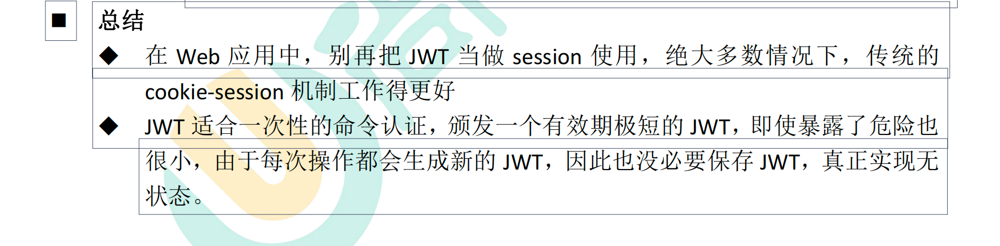

# ***@学习笔记***

# 一、Git

##  1、Git的作用

记录内容的变化，以便将来查阅特定版本修订情况，版本回溯

## 2、Git和SVN的区别

Git是分布式版本控制系统，保存的是每个版本的索引（可直接回退到任意版本），客户端不只是提取最新版本的文件快照，而是把代码仓库完整的镜像下来（这里面运用了压缩算法，相较SVN所占内存只多一点点）

CVS/SVN是集中化版本控制系统，有一个单一的集中管理的服务器，服务器中存放着所有的历史版本（保存的是相邻两个版本的差异，回退的效率非常低）和当前版本，而客户端只拉取当前最新版本，缺点：单点故障，服务器宕机，开发人员无法提交更新，也就无法协同工作

## 3、Git的结构

本地Git结构

==工作区->git add->暂存区->git commit->本地库==

### 推送远程GitHub流程

==本地库->git merge->本地库master分支->git pull->git push->远程仓库master分支或其他分支==

托管中心的类型

局域网环境下，搭建gitlab服务器作为代码托管中心

外网环境下，可以由GitHub（国外）或Gitee（国内）作为代码托管中心，不用自己搭建

## 4、Git命令

### 信息相关命令 

```bash
brew install git
# 安装Git
 
git --version
# git version 2.30.1 (Apple Git-130)
 
which git
# /usr/local/bin/git
# 查看git的安装目录

# 查看用户名以及邮箱
git config user.name
git config user.email

# 设置/更改用户名和邮箱
git config --global user.name "your name"
git config --global user.email "your email"

# 查看Git add 和 commit的文件状态
git status

# 查看提交时备注的信息
git log --stat

# 查看提交的从最近到最远的日志
# 有以下3种方式
git log
git log --oneline
git reflog

# 前进或后退历史版本（会同时重置本地库、暂存区、工作区） ID索引由git reflog获取
git reset --hard ID索引

# （了解）前进或后退历史版本（会重置本地库、暂存区，保留工作区） ID索引由git reflog获取
git reset --mixed ID索引
# 前进或后退历史版本（会重置本地库，保留暂存区、工作区） ID索引由git reflog获取
git reset --soft ID索引

# 将工作区和暂存区的指定文件进行比较
git diff 文件名
# 将工作区和暂存区的所有文件进行比较
git diff

# 比较工作区和本地仓库中差别
git diff ID索引 文件名
```

### 代码相关命令

```bash
# 首先需要初始化一个本地仓库，在任意位置新建一个文件夹
cd 到该文件夹的绝对路径

git init
# 初始化本地仓库，会生成一个.git的文件夹

git add -A
# 将所有的文件提交到暂存区
git add "文件名"
# 将指定的文件提交到暂存区
 
git commit -m "commit备注信息"
# 提交到本地仓库

git checkout master
git merge a
# 在主分支下合并a分支(首先需要先切换到主分支，表示以主分支为基准，合并其他分支的修改)

# 如果有冲突，可以选择处理冲突文件，修改冲突的内容（此时主分支上的冲突文件自动加载了分支上不同的内容），再次add commit(此时就不再是合并状态了，合并成功)
git merge --abort
# 如果有冲突，也可以先放弃merge，请求协助

# 回到本地仓库分支，我们会发现内容还是原本提交的有冲突的内容，因此在此分支上继续开发前需要将本地仓库主分支的代码拉取到分支

git pull
# 拉取远程仓库的代码

git push origin master
# 推送到远程仓库
# fatal: unable to access 'https://github.com/xxx/myRepository.git/': HTTP/2 stream 1 was not closed cleanly before end of the underlying stream
# 对于上述报错的解决方案(将默认通信协议修改为 http/1.1）
git config --global http.version HTTP/1.1
```

## 5、Git分支

在版本控制的过程中，使用多条分支同时推进多个任务，新的独立的功能开辟一个新的分支 

注意：切换不同分支后，在本地仓库的内容是相互独立的，内容随着分支的切换而改变

### 优点

并行开发，互不影响，开发效率高，防止代码污染

### 分支相关命令

```bash
# 查看分支
# 以下2种
git branch -v
git branch

# 创建分支
git branch 分支名

# 切换分支
git checkout 分支名
# 切换到主分支
git checkout main/master

# 创建并切换分支，在此分支进行代码修改并提交不影响主分支及其他分支
git checkout -b 分支名

# 删除a分支
git branch -D a
```

### 什么情况需要使用分支

1. 在本地使用分支

   本来在master分支上开发的,如果我每实现一个小的功能,就进行一次[commit](https://so.csdn.net/so/search?q=commit&spm=1001.2101.3001.7020)的话?那么分支上不就有很多的commit的吗?推送上去,您会看见服务器上有很多不必要的提交,这样子就不简洁了,版本历史也不清楚.但是使用分支,完成一个完整的功能,然后主分支使用 git merge --squash branchName 合并分支,做一个整的提交推送,那么服务器上的历史只有这一个commit的了,这不就简洁了吗?

2. 在服务端,我有多个小组,每个小组是一个分支,因为master是保持最稳定代码的版本,所以我要审查过每个分支上的代码再合并,而不是立刻将他们分支上的合并到master上面,一来保证了代码的质量,二来在小组方面可以更快发现bug,然后通知修改


## 6、GitHub远程仓库

```bash
# 取别名
git remote add 别名 仓库HTTP地址

# 查询远程仓库别名
git remote -v

# 推送（add commit 且 merge到本地库master分支后进行，为防止修改期间远程仓库的代码发生改变，先pull下代码进行对比，在工作区解决冲突后再次add commit 再push）
# git push origin master
git push 远程仓库别名 远程仓库分支名

# copy克隆github上code下的URL下载项目到当前文件夹
# 此时这个文件夹默认是git管控的，无需初始化本地库git init
# 默认远程仓库别名为origin，无需设置
git clone 仓库HTTP地址

# 抓取远程仓库的文件fetch+merge
git fetch origin master
# 抓取后查看远程仓库的内容是否正确(此时处于远程分支上，合并远程分支前需先切换回本地仓库主分支)
git checkout origin/master
ls
ls -a
git checkout master
git merge origin/master

# 以上拉取可以直接执行pull
git pull origin master

```

## 7、跨团队合作GitHub的使用

```bash
# 得到团队1远程库的地址
# 团队2登录GitHub账号 在主页网址栏输入团队1远程库的地址 点击fork（一般在star旁边）得到fork远程库
# clone到本地 进行修改
# push到fork远程库
# 发送pull request请求（在code导航栏旁边）
# 团队1同意merge pull request
```

## 8、SSH免密登录

```bash
# 进入用户主目录
cd ~
# 生成一个.ssh的文件
ssh-keygen -t rsa -C “github邮箱”
#一路回车
# 输出
# Your public key has been saved in 绝对路径
cat 绝对路径
# 输出 ssh-rsa .....="邮箱"
复制 ssh-rsa .....="邮箱"

配置：

GitHub右上角-个人头像-settings-SSH Keys

效果：

本机可免密拉取代码

# 可以给SSH地址取别名，提交代码改用git push origin_ssh master, 不使用HTTP地址（origin）实现免密登录
git remote add origin_ssh SSH地址
```

## 9、IDEA集成Git

### 本地创建项目

```bash
# 配置Git
settings->git->path to git executable:输出Git的路径（/usr/local/bin/git）
# 本地库初始化操作
VCS->import into version control->create git repository->选中需要初始化的文件

# IDEA中 修改项目提交到本地库
在本地仓库中对文件进行修改，如添加一个类后，会出现如下提示，这个add就是git add 文件 的等同操作，即将该类文件从工作区添加到暂存区，选择add后，文件会变成绿色

右键文件->git->commit file->输入commit的信息->commit

对文件进一步修改后->如果之前没有add File to git->右键文件->git->Add

->右键文件->git->commit file->输入commit的信息->commit

# 告诉Git允许不相关历史合并 2个仓库（本地库和远程仓库）有不同的开始点
git pull origin master --allow-unrelated-histories
git push -u origin master -f
# 此时本地库和远程库就可以进行交互了（此处特指本地库为自己在本地创建，没有从远程库pull过代码的情况）
```


### IDEA拉取项目

```bash
# IDEA中 拉取项目到本地库
file->new->project from version control

# IDEA中 修改项目提交到本地库
在本地仓库中对文件进行修改，如添加一个类后，会出现如下提示，这个add就是git add 文件 的等同操作，即将该类文件从工作区添加到暂存区，选择add后，文件会变成绿色

右键文件->git->commit file->输入commit的信息->commit

对文件进一步修改后->如果之前没有add File to git->右键文件->git->Add

->右键文件->git->commit file->输入commit的信息->commit

# IDEA中 修改项目提交到本地库后 推送到远程库
右键文件->git->repository->pull
有冲突先解决->add->commit
右键文件->git->repository->push
```

### 如何避免代码冲突

```bash
团队开发时避免再一个文件中改代码
修改一个文件前，在push前，先pull操作
```

## 10、ignore

### 安装插件

要使.gitignore文件生效，需要先安装.ignore插件

settings->plugins->安装.ignore插件（若搜索不到，可进入下面的地址获取）->重启IDEA

https://plugins.jetbrains.com/plugin/7495--ignore

### 创建文件

如果当前项目没有.gitignore文件：

在项目上右键->New ->.ignore file ->.gitignore file(Git)

### 配置文件

```xml
下面是一些.gitignore文件忽略的匹配规则：

*.a       # 忽略所有 .a 结尾的文件
!lib.a    # 但 lib.a 除外
/TODO     # 仅仅忽略项目根目录下的 TODO 文件，不包括 subdir/TODO
build/    # 忽略 build/ 目录下的所有文件
doc/*.txt # 会忽略 doc/notes.txt 但不包括 doc/server/arch.txt

```

### 特殊情况

.gitignore只能忽略那些原来没有被track的文件，如果某些文件已经被纳入了版本管理中，则修改.gitignore是无效的。那么解决方法就是先把本地缓存删除（改变成未track状态），然后再提交：

```bash
输入：
git rm -r –cached filePath
git commit -m "remove xx"
或者：
git rm -r --cached .
git add .
git commit -m "update .gitignore"
```

来解释下几个参数 

-r 是删除文件夹及其子目录 

--cached 是删除暂存区里的文件而不删除工作区里的文件，第一种是删除某个文件，第二种方法就把所有暂存区里的文件删了，再加一遍，相当于更新了一遍。


### 如何判断哪些文件需要ignore


需要忽略的文件
（1） mvnw
（2） mvnw.cmd
（3） .mvn
（4）target 不需提交 只需要编译后自己提取使用即可
（5）子模块的.[gitignore](https://so.csdn.net/so/search?q=gitignore&spm=1001.2101.3001.7020)文件
（6）.idea 文件

```.gitignore
**/mvnw
**/mvnw.cmd
**/.mvn
**/target/
.idea
**/.gitignore
```


# 二、缓存

## 详见： [05、缓存&分布式锁.pdf](../_pdf/05、缓存&分布式锁.pdf) 

# 1、Redis的使用

1、改pom

```java
				<dependency>
            <groupId>org.springframework.boot</groupId>
            <artifactId>spring-boot-starter-data-redis</artifactId>
        </dependency>
```

2、配置Redis主机和端口

3、注入客户端

```java
@Autowired
private StringRedisTemplate redisTemplate;
```

4、调用方法

```java
@RestController
@RequestMapping("/sms")
public class SmsSendController {
    @Autowired
    private SmsComponent smsComponent;
    @Autowired
    private StringRedisTemplate redisTemplate;
    @PostMapping("/sendcode")
    public R sendCode(HttpServletRequest request){
        String phone = request.getParameter("phone_num").trim();
        // 实现接口防刷
        String redisCode = redisTemplate.opsForValue().get("sms_code_" + phone);
        if (!StringUtils.isEmpty(redisCode)) {
            Long redisCodeTime = Long.parseLong(redisCode.split("_")[1]);
            if (System.currentTimeMillis() - redisCodeTime < 60000) {
                // 60秒内不能再次发送
                return R.error(BizCodeEnum.SMS_CODE_EXCEPTION.getCode(), BizCodeEnum.SMS_CODE_EXCEPTION.getMsg());
            }
        }
      	String code = String.valueOf((int) (Math.random() * 900000 + 100000));
        // 验证码的再次校验，直接存在Redis
        redisTemplate.opsForValue().set("sms_code_"+phone,code+"_"+System.currentTimeMillis(),10, TimeUnit.MINUTES);


        System.out.println(code);
        smsComponent.sendSmsCode(phone,code);
        return R.ok();
    }
}

```

## 解决缓存失效问题

1、缓存穿透：查询一定不存在的数据

解决：缓存空结果null，并且设置过期时间

2、缓存雪崩：大量缓存同时失效

解决：原有失效时间上增加随机值

3、缓存击穿：超高并发访问一个正好失效的Key

解决：加锁

## 解决缓存数据一致性的问题

1、双写模式-写数据库，写缓存

问题：有暂时性的脏数据问题，由于卡顿等原因

2、失效模式-写数据库，删缓存

问题：有暂时性的脏数据

3、解决方案

- 对于实时性、一致性要求不高的：加过期时间；加读写锁


- 对于实时性、一致性要求高的：直接查数据库


# 2、Redisson的使用

整合了分布式锁功能


# 3、SpringCache的使用

每次调用缓存功能的方法时，先去Redis中查，如果没有才会查数据库，同时更新缓存

使用策略：

- 确定方法需要被缓存以及缓存策略


- 优先从缓存中读取


## 3.1、改pom

```xml
				<dependency>
            <groupId>org.springframework.boot</groupId>
            <artifactId>spring-boot-starter-cache</artifactId>
        </dependency>
        <dependency>
            <groupId>org.springframework.boot</groupId>
            <artifactId>spring-boot-starter-data-redis</artifactId>
        </dependency>
```

## 3.2、配置apllication.properties

```properties
# 设置Redis连接信息
spring.redis.host=localhost
spring.redis.port=6379
# 指定SpringCache的类型为Redis
spring.cache.type=redis
# 设置Redis过期时间-30分钟-以毫秒为单位
spring.cache.redis.time-to-live=1800000
# 如果指定了前缀就用我们指定的前缀，如果没有就默认使用缓存的名字作为前缀
# "CACHE_allSinger"
# spring.cache.redis.key-prefix=CACHE_
# "singer::allSinger"默认就是true，使用前缀
# spring.cache.redis.use-key-prefix=true
# "allSinger"
# spring.cache.redis.use-key-prefix=false

# 是否缓存空值，防止缓存穿透
spring.cache.redis.cache-null-values=true
```

## 3.3、主启动类配置注解

```java
@EnableCaching
```

## 3.4、service的实现类的方法上配置注解

双写模式

```java
@Cacheable(value = {"singer"},key = "# root.method.name",sync = true)
```

失效模式

```java
		@CacheEvict(value = "singer",allEntries = true)
    @Override
    public boolean update(Singer singer) {
        return singerMapper.update(singer)>0;
    }
/**
     * 级联更新所有关联的数据
     *
     * @CacheEvict:失效模式
     * @CachePut:双写模式，需要有返回值
     * 1、同时进行多种缓存操作：@Caching
     * 2、指定删除某个分区下的所有数据 @CacheEvict(value = "category",allEntries = true)
     * 3、存储同一类型的数据，都可以指定为同一分区
     * @param category
     */
    // @Caching(evict = {
    //         @CacheEvict(value = "category",key = "'getLevel1Categorys'"),
    //         @CacheEvict(value = "category",key = "'getCatalogJson'")
    // })
    // @CacheEvict(value = "category",allEntries = true)       //删除某个分区下的所有数据
```


## 3.5、自定义配置类

MyCacheConfig.java

将主启动类的配置注解移到该配置类上

```java
package com.flora.music.config;

import org.springframework.boot.autoconfigure.cache.CacheProperties;
import org.springframework.boot.context.properties.EnableConfigurationProperties;
import org.springframework.cache.annotation.EnableCaching;
import org.springframework.context.annotation.Bean;
import org.springframework.context.annotation.Configuration;
import org.springframework.data.redis.cache.RedisCacheConfiguration;
import org.springframework.data.redis.serializer.GenericJackson2JsonRedisSerializer;
import org.springframework.data.redis.serializer.RedisSerializationContext;
import org.springframework.data.redis.serializer.StringRedisSerializer;

/**
 * @Author qinxiang
 * @Date 2023/1/12-下午9:22
 * 1、修改存入Redis时key 和 value的序列化规则，使其存入JSON格式
 * 2、将配置文件中所有的application.properties配置都生效，否则配置的过期时间将不生效 为-1
 */
@EnableConfigurationProperties(CacheProperties.class)
@Configuration
@EnableCaching
public class MyCacheConfig {
    @Bean
    public RedisCacheConfiguration redisCacheConfiguration(CacheProperties cacheProperties) {

        RedisCacheConfiguration config = RedisCacheConfiguration.defaultCacheConfig();
        // config = config.entryTtl();
        //修改存入Redis时key 和 value的序列化规则
        config = config.serializeKeysWith(RedisSerializationContext.SerializationPair.fromSerializer(new StringRedisSerializer()));
        config = config.serializeValuesWith(RedisSerializationContext.SerializationPair.fromSerializer(new GenericJackson2JsonRedisSerializer()));

        CacheProperties.Redis redisProperties = cacheProperties.getRedis();
        //将配置文件中所有的配置都生效
        if (redisProperties.getTimeToLive() != null) {
            config = config.entryTtl(redisProperties.getTimeToLive());
        }
        if (redisProperties.getKeyPrefix() != null) {
            config = config.prefixKeysWith(redisProperties.getKeyPrefix());
        }
        if (!redisProperties.isCacheNullValues()) {
            config = config.disableCachingNullValues();
        }
        if (!redisProperties.isUseKeyPrefix()) {
            config = config.disableKeyPrefix();
        }

        return config;
    }

}

```

# 三、线程

##  详见：[07、异步&线程池.pdf](../_pdf/07、异步&线程池.pdf) 


## 1、初始化线程的4种方式

1）、继承 Thread 

2）、实现 Runnable 接口 

3）、实现 Callable 接口 + FutureTask （可以通过get方法拿到返回结果，可以处理异常） 

4）、线程池

具体实现描述：

```java
// 1、继承Thread，重写run方法，new对象，调用对象的start方法
// 2、实现 Runnable 接口 ，重写run方法，new对象，new Thread(传入对象)，调用Thread的start方法
// 3、实现 Callable 接口 ，重写call方法，new对象，new FutureTask<>(传入对象)，new Thread(传入FutureTask对象)，调用Thread的start方法
// 4、线程池 Executors.newFixedThreadPool(线程数)，作为常量放在前面，调用execute(传入对象)，该对象可以是实现了Runnable接口的类的对象
// 4、线程池 new ThreadPoolExecutor(corePoolSize, maximumPoolSize, keepAliveTime, TimeUnit unit, workQueue, threadFactory, handler);
```

### 区别

1/2不能获得返回值，3可以获得返回值，1/2/3不能控制资源，资源耗尽风险，4可以控制资源，性能稳定

## 2、线程池的七大参数

```java
public ThreadPoolExecutor(int corePoolSize,
                          int maximumPoolSize,
                          long keepAliveTime,
                          TimeUnit unit,
                          BlockingQueue<Runnable> workQueue,
                          ThreadFactory threadFactory,
                          RejectedExecutionHandler handler) {
    //...
}
```

1. corePoolSize：核心线程数，线程池正常情况下保持的线程数，大户人家“长工”的数量。
2. maximumPoolSize：最大线程数，当线程池繁忙时最多可以拥有的线程数，大户人家“长工”+“短工”的总数量。
3. keepAliveTime：空闲线程存活时间，没有活之后“短工”可以生存的最大时间。
4. TimeUnit：时间单位，配合参数 3 一起使用，用于描述参数 3 的时间单位。
5. BlockingQueue：线程池的任务队列，用于保存线程池待执行任务的容器。
6. ThreadFactory：线程工厂，用于创建线程池中线程的工厂方法，通过它可以设置线程的命名规则、优先级和线程类型。
7. RejectedExecutionHandler：拒绝策略，当任务量超过线程池可以保存的最大任务数时，执行的策略。

## 3、为什么使用线程池

- 降低资源消耗，通过重复利用已经创建好的线程降低线程的创建和销毁带来的损耗


- 响应速度快，因为线程池中的线程数没有超过线程池的最大上限时，有的线程处于等待分配任务的状态，当任务来时无需创建新的线程就能执行


- 可管理性高，线程池会根据当前系统特点对池内的线程进行优化处理，减少创建和销毁线程带来的系统开销。无限的创建和销毁线程不仅消耗系统资源，还降低系统的稳定性，使用线程池进行统一分配


## 4、CompletableFuture类

解决：Future对于任务结果的获取不方便，只能通过阻塞（get()）或者轮询（消耗CPU资源）的方式得到

详细API见上方PDF

# 四、Nginx

## 1、正向代理与反向代理

正向代理服务器：这类代理位于用户之前，在用户与其访问的网页服务器之间充当中介。这就是说用户的请求要通过正向代理后才能抵达网页。从互联网检索数据后，这些数据就会被发送到代理服务器并将其**重定向**后返回请求者。从互联网服务器的角度来看，这个请求是有代理服务器、而不是用户发送的。

作用：

1. 访问受限地理位置
2. 匿名性
3. 网络抓取

反向代理服务器：即以代理服务器来接受internet上的连接请求，然后将请求转发给内部网络上的服务器，并将从服务器上得到的结果返回给internet上请求连接的客户端，此时代理服务器对外就表现为一个服务器。

作用：

1. 负载均衡 如轮询、加权轮询、iphash
2. 缓存 如动静分离，静态资源存在Nginx
3. 匿名性 安全性


区别：

- 正向代理由客户端使用，例如专用网络内的用户；反向代理由互联网服务器使用

- 正向代理确保网站绝不与用户直接通信；反向代理确保用户不会与后端服务器直接通信

Nginx主要完成的工作就是反向代理，比如我们向一台服务器的80端口发送了请求，该请求首先由Nginx监听到，其接受到请求内容后再转发给其他服务器，其他服务器处理完后再将结果传送给Nginx，最后由Nginx来统一返回给初始请求端。

## 2、解决问题

要访问后台页面，还得自己加上端口：`http://api.gmall.com:8888`。这就不够优雅了。我们希望的是直接域名访问：`http://api.gmall.com`。这种情况下端口默认是80，而80端口只有一个，将来我们可能有多个工程需要通过域名访问，如何让多个工程都直接通过域名访问呢？

### 查看Nginx配置

```bash
docker ps
docker exec -it ID /bin/bash
ls
cd etc/nginx
ls
```

### Nginx配置文件

文件结构：


Nginx.conf文件


#### 域名映射

说明：

Nginx.conf的http部分引入了conf.d下的所有文件

可直接在此目录下新增server配置

```bash
# 代理音乐网站客户端
    server {
    		# 监听端口号
        listen       80;
        # 域访问名 可配置多个
        server_name  floramusic.com;
				# 代理到的服务器位置 /代表根目录 可增加其他后缀配置多个域名映射location
        location / {
            proxy_pass   http://127.0.0.1:8080;
        }
    }
```

#### 负载均衡

http内还可以配置负载均衡

```bash
# 两台服务器轮询
upstream kuangstudy {
		server 127.0.0.1:8080 weight=1;
		server 127.0.0.1:8081 weight=1;
}
server {
		# 监听端口号
    listen       80;
    # 域访问名 可配置多个
    server_name  localhost;
    # 代理到的服务器位置 /代表根目录 可增加其他后缀配置多个域名映射location
    location / {
    		proxy_pass   http://kuangstudy;
    }
}

upstream music {
        server 127.0.0.1:8080 weight=1;
        server 127.0.0.1:8082 weight=1;
        keepalive 256;
    }
```

#### 静态资源部署

什么是动静分离

静：img/js/css等静态资源 以实际文件存在的方式

动：服务器需要处理的请求

1、将静态资源static文件夹移到Nginx的html文件夹下

2、修改nginx的配置文件，添加一个server location配置，使静态资源可以正常的通过nginx访问，此配置应该放在负载均衡location的前面

```nginx
server {
    listen       80;
    server_name  floramusic.com;

    location /static/ {
        root   /usr/share/nginx/html;
    }
}
```

3、访问静态资源的路径带前缀static

# 五、域名配置

```bash
# 修改本地的hosts文件 使IP地址映射到指定的域名
cd /etc
sudo vim hosts
# 添加flora.com 点击i进入编辑模式 完成后点击esc 退出编辑模式 输入:wq 保存并退出
127.0.0.1       localhost flora.com
```

# 六、Elasticsearch

##  详见：[06、ElasticSearch.pdf](../_pdf/06、ElasticSearch.pdf) 

背景：用于快速存储、搜索、分析海量数据

## 1、存储结构


对比MySQL：

     索引（indices）----------------------Databases 数据库
    
      类型（type）（Elasticsearch8以后移除了该概念）--------------------------Table 数据表
     
     		文档（Document）----------------------Row 行
    
        	字段（Field）-------------------------Columns 列 

## 2、重要概念：倒排索引


## 3、使用示例

PUT方法新增


GET方法查询


结果分析


## 4、应用：乐观锁

更新携带if_seq_no 并发修改时只有一个可以修改成功（修改后_seq_no加1，导致其他请求无效）

## 5、应用：版本号控制

_update新增


带_update元数据不变进行请求


不带_update元数据不变进行请求

总结：带_update 对比元数据如果一样就不进行任何操作，文档 version 不增加 。 

使用场景：

对于大并发更新，不带 update； 

对于大并发查询偶尔更新，带 update；对比更新，重新计算分配规则。

## 6、常用方法

```js
# 检索索引下的所有信息
GET bank/_search
# q=*查询所有 按account_number升序返回
GET bank/_search?q=*&sort=account_number:asc
# 以请求体的形式进行检索
GET bank/_search
{
  "query": {
    "match_all": {}
  },
  "sort": [
    {
      "account_number": "asc"
    }
  ],
  "from": 0,
  "size": 3,
  "_source": [
    "balance",
    "city"
  ]
}
# 匹配
GET bank/_search
{
  "query": {"match": {
    "city": "Bennett"
  }}
}
GET bank/_search
{
  "query": {"match": {
    "address": "place 8"
  }}
}
# 复合查询bool
GET bank/_search
{
  "query": {
    "bool": {
      "must": [
        {
          "match": {
            "state": "WA"
          }
        }
      ]
      , "should": [
        {"match": {
          "gender": "M"
        }}
      ]
      , "must_not": [
        {"match": {
          "firstname": "Bridget"
        }}
      ]
    }
  }
}
# 过滤 不计算相关性得分
GET bank/_search
{
  "query": {
    "bool": {
      "filter": [
        {
          "range": {
            "balance": {
              "gte": 10000,
              "lte": 20000
            }
          }
        }
      ]
    }
  }
}
# 全文检索字段用 match，其他非 text 字段匹配用 term
GET bank/_search
{
  "query": {
    "term": {
      "age": {
        "value": "34"
      }
    }
  }
}
# 聚合 匹配gender为M，以年龄聚合后再聚合平均薪资，同时以年龄的平均数聚合
GET bank/_search
{
  "query": {
    "match": {
      "gender": "M"
    }
  },
  "aggs": {
    "aggAge": {
      "terms": {
        "field": "age"
      },
      "aggs": {
        "aggAgeAndAvgBalance": {
          "avg": {
            "field": "balance"
          }
        }
      }
    },
    "aggAvg":{
      "avg": {
        "field": "age"
      }
    }
  }
}
```

## 7、Mapping 数据迁移

```js
# mapping
GET bank/_mapping
# 创建索引并指定映射,之前是系统根据输入自定义数据类型
PUT /my_index
{
  "mappings": {
    "properties": {
      "age":{"type": "integer"},
      "email":{"type": "keyword"},
      "name":{"type": "text"}
    }
  }
}
# 添加新的映射，已经存在的映射只能通过添加的方式对其进行修改，index用于控制字段是否可检索
PUT my_index/_mapping
{
  "properties":{
    "employee_id":{
      "type":"keyword",
      "index":false
    }
  }
}
# 数据迁移-首先创建新的索引
GET bank/_search
GET bank/_mapping
PUT newbank
{
  "mappings": {
    "properties": {
      "account_number": {
        "type": "long"
      },
      "address": {
        "type": "text"
      },
      "age": {
        "type": "integer"
      },
      "balance": {
        "type": "long"
      },
      "city": {
        "type": "keyword"
      },
      "email": {
        "type": "keyword"
      },
      "employer": {
        "type": "keyword"
      },
      "firstname": {
        "type": "text"
      },
      "gender": {
        "type": "keyword"
      },
      "lastname": {
        "type": "text",
        "fields": {
          "keyword": {
            "type": "keyword",
            "ignore_above": 256
          }
        }
      },
      "state": {
        "type": "keyword"
      }
    }
  }
}
GET newbank
# 数据迁移-去除类型"type": "account" 迁移索引
POST _reindex
{
  "source": {
    "index": "bank",
    "type": "account"
  },
  "dest": {
    "index": "newbank"
  }
}
GET newbank/_search
```

## 8、分词器

1、下载-对应elasticsearch版本

https://github.com/medcl/elasticsearch-analysis-ik/releases/tag/v7.14.1

解压到elasticsearch的plugins目录下 /Users/qinxiang/Documents/docker/Elasticsearch/plugins/elasticsearch-analysis-ik-7.14.1

重启elasticsearch

```js
# 分词 "analyzer": "ik_max_word" 最大程度的分词；"analyzer": "ik_smart" 智能分词
POST _analyze
{
  "analyzer": "ik_smart",
  "text": "我是中国人"
}
```

自定义分词

可以维护一个txt，将该文件放到Nginx的html文件夹下

可通过网址直接访问

http://127.0.0.1/es/fenci.txt

修改ik分词器的远程地址 

文件位置 /Users/qinxiang/Documents/docker/Elasticsearch/plugins/elasticsearch-analysis-ik-7.14.1/config/IKAnalyzer.cfg.xml

```xml
<?xml version="1.0" encoding="UTF-8"?>
<!DOCTYPE properties SYSTEM "http://java.sun.com/dtd/properties.dtd">
<properties>
	<comment>IK Analyzer 扩展配置</comment>
	<!--用户可以在这里配置自己的扩展字典 -->
	<entry key="ext_dict"></entry>
	 <!--用户可以在这里配置自己的扩展停止词字典-->
	<entry key="ext_stopwords"></entry>
	<!--用户可以在这里配置远程扩展字典 -->
	<entry key="remote_ext_dict">http://127.0.0.1/es/fenci.txt</entry>
	<!--用户可以在这里配置远程扩展停止词字典-->
	<!-- <entry key="remote_ext_stopwords">words_location</entry> -->
</properties>

```

## 9、整合springboot

1、导入pom依赖 这里的版本号只是控制plugin的版本

```
        <dependency>
            <groupId>org.elasticsearch.client</groupId>
            <artifactId>elasticsearch-rest-high-level-client</artifactId>
            <version>7.14.1</version>
        </dependency>

```

由于springboot2.7.7整合的elasticsearch版本为7.17.8

在项目的pom文件中我们需要新增<elasticsearch.version>7.14.1</elasticsearch.version>


此时elasticsearch客户端的下面2项的版本号才会发生变化


2、编写配置

```java
package com.flora.music.config;

import org.apache.http.HttpHost;
import org.elasticsearch.client.RequestOptions;
import org.elasticsearch.client.RestClient;
import org.elasticsearch.client.RestHighLevelClient;
import org.springframework.context.annotation.Bean;
import org.springframework.context.annotation.Configuration;

/**
 * @Author qinxiang
 * @Date 2023/1/16-下午7:35
 * elasticsearch的配置
 * 当前配置的是本机的es 如果有多个，可以new多个，指定主机、端口号及协议名
 * 用@bean注入到容器
 */
@Configuration
public class ElasticsearchConfig {
    public static final RequestOptions COMMON_OPTIONS;
    static {
        RequestOptions.Builder builder = RequestOptions.DEFAULT.toBuilder();
        COMMON_OPTIONS = builder.build();
    }
    @Bean
    public RestHighLevelClient esRestClient(){
        RestHighLevelClient client = new RestHighLevelClient(
                RestClient.builder(
                new HttpHost("localhost",9200,"http")
                ));
        return client;

    }
}

```

可进行单元测试

```java
package com.flora.music;

import com.alibaba.fastjson.JSON;
import com.flora.music.config.ElasticsearchConfig;
import com.flora.music.domain.Singer;
import org.elasticsearch.action.index.IndexRequest;
import org.elasticsearch.action.index.IndexResponse;
import org.elasticsearch.action.search.SearchRequest;
import org.elasticsearch.action.search.SearchResponse;
import org.elasticsearch.client.RestHighLevelClient;
import org.elasticsearch.common.xcontent.XContentType;
import org.elasticsearch.index.query.QueryBuilder;
import org.elasticsearch.index.query.QueryBuilders;
import org.elasticsearch.search.SearchHit;
import org.elasticsearch.search.SearchHits;
import org.elasticsearch.search.builder.SearchSourceBuilder;
import org.junit.jupiter.api.Test;
import org.springframework.beans.factory.annotation.Autowired;
import org.springframework.boot.test.context.SpringBootTest;

import java.io.IOException;
import java.text.SimpleDateFormat;
import java.util.Date;
import java.util.Map;

@SpringBootTest
class MusicApplicationTests {
    @Autowired
    private RestHighLevelClient client;
    // 获取操作elasticsearch的客户端
    @Test
    void contextLoads() {
        System.out.println(client);
    }
    // 添加
    @Test
    void indexData() throws IOException {
        Singer singer = new Singer();
        singer.setName("周杰伦");
        singer.setLocation("中国");
        singer.setIntroduction("华语乐坛天王");
        singer.setSex(new Byte("1"));
        String s = JSON.toJSONString(singer);
        IndexRequest indexRequest = new IndexRequest("singer");
        indexRequest.id("1");
        indexRequest.source(s, XContentType.JSON);
        IndexResponse index = client.index(indexRequest, ElasticsearchConfig.COMMON_OPTIONS);
        System.out.println(index);
    }
    //查询
    @Test
    void searchData() throws IOException {
        SearchRequest searchRequest = new SearchRequest();
        searchRequest.indices("singer");
        SearchSourceBuilder searchSourceBuilder = new SearchSourceBuilder();
        searchSourceBuilder.query(QueryBuilders.matchQuery("name","周杰伦"));
        searchRequest.source(searchSourceBuilder);
        SearchResponse search = client.search(searchRequest, ElasticsearchConfig.COMMON_OPTIONS);
        SearchHits hits = search.getHits();
        SearchHit[] searchHits = hits.getHits();
        for (SearchHit hit:searchHits){
//            Map<String, Object> map = hit.getSourceAsMap();
//            System.out.println(map);
            String sourceAsString = hit.getSourceAsString();
            // 把返回结果封装成Singer类
            Singer singer = JSON.parseObject(sourceAsString, Singer.class);
            System.out.println(singer);
        }
    }

}

```

# 七、thymeleaf

##  详见：[7、模板引擎-Thymeleaf.md](../代码库/谷粒商城/谷粒商城-源码/Guli Mall/文档/开发阶段文档md/7、模板引擎-Thymeleaf.md) 

用来开发Web的服务器端Java模板引擎，可在Java独立环境中运行，作为静态原型直接显示正确结果在浏览器中

JSP与Thymeleaf:

springboot不推荐JSP

一般的模板技术（Jsp和Freemarker）都会在页面添加 各种表达式、标签甚至是java代码，而这些都必须要经过后台服务器的渲染才能打开。但如果前端开发人员做页面调整，双击打开某个jsp或者ftl来查看效果，基本上是打不开的。

那么Thymeleaf的优势就出来了，因为Thymeleaf没有使用自定义的标签或语法，所有的模板语言都是扩展了标准H5标签的属性

## 1、整合springboot

1、导入pom依赖

```java

      <!-- 配置devtools command+shift+F9 可以实时显示页面变化，不需要重启后台服务-->
      	<dependency>
            <groupId>org.springframework.boot</groupId>
            <artifactId>spring-boot-devtools</artifactId>
          	<optional>true</optional>
        </dependency>
        <dependency>
            <groupId>org.springframework.boot</groupId>
            <artifactId>spring-boot-starter-thymeleaf</artifactId>
        </dependency>
        
```

2、改配置文件

Thymeleaf默认会开启页面缓存，提高页面并发能力。但会导致开发时修改页面不会立即被展现，因此关闭缓存：

```properties
# 关闭Thymeleaf的缓存
spring.thymeleaf.cache=false
```

另外，每次修改完毕页面，需要使用快捷键：`Ctrl + Shift + F9`来刷新工程。

thymeleaf解析方式与jsp类似：前缀 + 视图名 + 后缀。

在Thymeleaf的配置类中配置了默认的前缀和后缀：

- 默认前缀：`classpath:/templates/`
- 默认后缀：`.html`
- 默认编码：UTF_8

所以如果我们返回视图：`users`，会指向到 `classpath:/templates/users.html`

3、resources目录下的templates新建一个html

hello.html

```html
<!DOCTYPE html>
<html lang="en" xmlns:th="http://www.thymeleaf.org">
<head>
    <meta charset="UTF-8">
    <title>hello</title>
</head>
<body>
    <h1 th:text="${msg}">大家好</h1>
</body>
</html>
```

**注意**，把html 的名称空间，改成：`xmlns:th="http://www.thymeleaf.org` 会有语法提示

4、写controller，控制视图跳转

```java
@Controller
public class HelloController {

    @GetMapping("show1")
    public String show1(Model model){
        model.addAttribute("msg", "Hello, Thymeleaf!");
        return "hello";
    }
}
```

优化：

发送请求跳转到页面 采用springMVC viewcontroller:将请求和页面映射过来

写config，控制视图跳转

```java
@Configuration
public class GulimallWebConfig implements WebMvcConfigurer {

    /**·
     * 视图映射:发送一个请求，直接跳转到一个页面
     * @param registry
     */
    @Override
    public void addViewControllers(ViewControllerRegistry registry) {

        // registry.addViewController("/login.html").setViewName("login");
        registry.addViewController("/reg.html").setViewName("reg");
    }
}
```


5、访问页面

http://localhost:8888/show1

返回hello.html页面

# 八、短信验证码

参考阿里云提供的API请求示例

https://market.aliyun.com/products/57126001/cmapi00037415.html?spm=5176.730005.recommend-commodity.d0.397b123eUwU0qx#sku=yuncode3141500001

1、在测试类中进行测试

先创建好HttpUtils类

```java
//测试短信发送-阿里云
    @Test
    void sendCode() {
        String host = "https://gyytz.market.alicloudapi.com";
        String path = "/sms/smsSend";
        String method = "POST";
        String appcode = "762689c204704b2eb982e5647936edec";
        Map<String, String> headers = new HashMap<String, String>();
        //最后在header中的格式(中间是英文空格)为Authorization:APPCODE 83359fd73fe94948385f570e3c139105
        headers.put("Authorization", "APPCODE " + appcode);
        Map<String, String> querys = new HashMap<String, String>();
        querys.put("mobile", "15545334996");
        querys.put("param", "**code**:888888,**minute**:5");
        querys.put("smsSignId", "2e65b1bb3d054466b82f0c9d125465e2");
        querys.put("templateId", "908e94ccf08b4476ba6c876d13f084ad");
        Map<String, String> bodys = new HashMap<String, String>();


        try {
            /**
             * 重要提示如下:
             * HttpUtils请从
             * https://github.com/aliyun/api-gateway-demo-sign-java/blob/master/src/main/java/com/aliyun/api/gateway/demo/util/HttpUtils.java
             * 下载
             *
             * 相应的依赖请参照
             * https://github.com/aliyun/api-gateway-demo-sign-java/blob/master/pom.xml
             */
            HttpResponse response = HttpUtils.doPost(host, path, method, headers, querys, bodys);
            System.out.println(response.toString());
            //获取response的body
            System.out.println(EntityUtils.toString(response.getEntity()));
        } catch (Exception e) {
            e.printStackTrace();
        }
    }
```

2、对该功能进行封装

2.1 短信组件类SmsComponent

```java
package com.flora.music.component;

import com.flora.music.utils.HttpUtils;
import lombok.Data;
import org.apache.http.HttpResponse;
import org.apache.http.util.EntityUtils;
import org.springframework.boot.context.properties.ConfigurationProperties;
import org.springframework.stereotype.Component;

import java.util.HashMap;
import java.util.Map;

/**
 * @Author qinxiang
 * @Date 2023/1/18-下午7:46
 */
@ConfigurationProperties(prefix = "spring.alicloud.sms")
@Data
@Component
public class SmsComponent {
    private String host;
    private String path;
    private String appcode;
    private String smsSignId;
    private String templateId;
    public void sendSmsCode(String phone,String code){
        String method = "POST";
        Map<String, String> headers = new HashMap<String, String>();
        //最后在header中的格式(中间是英文空格)为Authorization:APPCODE 83359fd73fe94948385f570e3c139105
        headers.put("Authorization", "APPCODE " + appcode);
        Map<String, String> querys = new HashMap<String, String>();
        querys.put("mobile", phone);
        querys.put("param", "**code**:"+code+",**minute**:5");
        querys.put("smsSignId", smsSignId);
        querys.put("templateId", templateId);
        Map<String, String> bodys = new HashMap<String, String>();


        try {
            HttpResponse response = HttpUtils.doPost(host, path, method, headers, querys, bodys);
            System.out.println(response.toString());
            //获取response的body
            System.out.println(EntityUtils.toString(response.getEntity()));
        } catch (Exception e) {
            e.printStackTrace();
        }
    }
}

```

2.2 创建配置文件application.yml

```yaml
spring:
  alicloud:
    sms:
      host: https://gyytz.market.alicloudapi.com
      path: /sms/smsSend
      appcode: 762689c204704b2eb982e5647936edec
      sms-sign-id: 2e65b1bb3d054466b82f0c9d125465e2
      template-id: 908e94ccf08b4476ba6c876d13f084ad
```


2.3 创建SmsSendController类

```java
package com.flora.music.controller;

import com.flora.music.component.SmsComponent;
import com.flora.music.exception.BizCodeEnum;
import com.flora.music.utils.R;
import org.apache.commons.lang.StringUtils;
import org.springframework.beans.factory.annotation.Autowired;
import org.springframework.data.redis.core.StringRedisTemplate;
import org.springframework.web.bind.annotation.PostMapping;
import org.springframework.web.bind.annotation.RequestMapping;
import org.springframework.web.bind.annotation.RequestParam;
import org.springframework.web.bind.annotation.RestController;

import javax.servlet.http.HttpServletRequest;
import java.util.concurrent.TimeUnit;

/**
 * @Author qinxiang
 * @Date 2023/1/18-下午8:23
 */
@RestController
@RequestMapping("/sms")
public class SmsSendController {
    @Autowired
    private SmsComponent smsComponent;
    @Autowired
    private StringRedisTemplate redisTemplate;
    @PostMapping("/sendcode")
    public R sendCode(HttpServletRequest request){
        String phone = request.getParameter("phone_num").trim();
        // 实现接口防刷
        String redisCode = redisTemplate.opsForValue().get("sms_code_" + phone);
        if (!StringUtils.isEmpty(redisCode)) {
            Long redisCodeTime = Long.parseLong(redisCode.split("_")[1]);
            if (System.currentTimeMillis() - redisCodeTime < 60000) {
                // 60秒内不能再次发送
                return R.error(BizCodeEnum.SMS_CODE_EXCEPTION.getCode(), BizCodeEnum.SMS_CODE_EXCEPTION.getMsg());
            }
        }
        // 这种方式会带字母，不符合当前的短信内容格式
        // String code = UUID.randomUUID().toString().substring(0,6);
        String code = String.valueOf((int) (Math.random() * 900000 + 100000));
        // 验证码的再次校验，直接存在Redis
        redisTemplate.opsForValue().set("sms_code_"+phone,code+"_"+System.currentTimeMillis(),10, TimeUnit.MINUTES);


        System.out.println(code);
        smsComponent.sendSmsCode(phone,code);
        return R.ok();
    }
}
```

2.4 前端发送请求，获取验证码

# 九、后端接收参数的方式

https://www.cnblogs.com/mask-xiexie/p/15994437.html

# 十、加密

1、MD5 

Message Digest algorithm 5，信息摘要算法 

• 压缩性：任意长度的数据，算出的MD5值长度都是固定的。 

• 容易计算：从原数据计算出MD5值很容易。 

• 抗修改性：对原数据进行任何改动，哪怕只修改1个字节，所得到的MD5值都有很大区别。 

• 强抗碰撞：想找到两个不同的数据，使它们具有相同的MD5值，是非常困难的。 

• 不可逆 

加盐： 

• 通过生成随机数与MD5生成字符串进行组合 

• 数据库同时存储MD5值与salt值。验证正确性时使用salt进行MD5即可

2、对MD5加盐的实现类BCryptPasswordEncoder：

2.1 POM依赖

```
<dependency>
    <groupId>org.springframework.security</groupId>
    <artifactId>spring-security-web</artifactId>
</dependency>
<dependency>
    <groupId>org.springframework.security</groupId>
    <artifactId>spring-security-config</artifactId>
</dependency>
```

2.2 使用

```
BCryptPasswordEncoder bcryptPasswordEncoder = new BCryptPasswordEncoder();
加密:
bcryptPasswordEncoder.encode(password);
 
//password是输入的密码，encodedPassword是通过bcryptPasswordEncoder进行加密的密码
解密:
bcrytPasswordEncoder.matches(password,encodedPassword)
```

# 十一、equals与==

```java
if(username == null || username.equals(""))
// 双重比较，username == null 表示username没有指向任何一块内存地址，username.equals("") 表示username指向了一块字符串为空的内存地址
```

以下几点需要了解：

- null是任何引用类型的默认值
- 任何含有null值的包装类在Java拆箱生成基本数据类型时候都会抛出一个空指针异常。（例如Integer拆箱成int时）
- 如果使用了带有null值的引用类型变量，instanceof操作将会返回false。（instanceof：用来在运行时指出对象是否是特定类的一个实例，例如：Integer num = null，那么，调用 num instanceof Integer时会返回false）
- 不能调用非静态方法来使用一个值为null的引用类型变量，它将会抛出空指针异常；可以使用静态方法来使用一个值为null的引用类型变量，因为静态方法使用静态绑定，不会抛出空指针异常。

```java
// 举例

//假设我们现在有一个类，例如String，对于如下代码：
String str = null;
if (str.equals("Hello World!")){
    System.out.println("Yes");
}else {
    System.out.println("No");
}
// 就会抛出空指针异常，但是，如果我们把第二行的条件判断改为：

if ("Hello World!".equals(str))
  
//就不会抛出空指针异常，因为String的equals方法不是Static方法

// 测试equals结果
    // java.lang.NullPointerException
    @Test
    void equalsTest(){
        String username = null;
        if (username.equals("")){
            System.out.println("true");
        }
    }

		// true
    @Test
    void equalsTest(){
        String username = null;
        if (username == null || username.equals("")){
            System.out.println("true");
        }
    }

		// false
		@Test
    void equalsTest(){
        String username = null;
        if ("".equals(username)){
            System.out.println("true");
        }else {
            System.out.println("false");
        }
    }
```

# 十二、社交登录


微博登录-待补充

https://open.weibo.com/

# 十三、Session


问题：分布式下，同一服务复制多份，session不能同步；不同服务session不能共享

解决方案：

1、采用session复制同步方案

限制：对于大型分布式，数据是所有session的总和，内存限制；数据传输，占用网络带宽

2、客户端存储

不占用服务器资源

限制：每次http请求，携带用户在cookie中的完整信息， 浪费网络带宽；session数据放在cookie中，cookie有长度限制 

4K，不能保存大量信息；session数据放在cookie中，存在泄漏、篡改、 窃取等安全隐患

3、hash一致性

同一个用户ip_hash负载均衡到同一台服务器，只需要改Nginx配置

限制：服务器闪断和服务器水平拓展(分配规则发生变化)的问题

4、统一存储

Redis存储-springsession服务

限制：增加了一次网络调用，Redis获取数据比内存慢

## 1、SpringSession

背景：HTTP协议本身是无状态的，为了保存会话信息，浏览器Cookie通过SessionID标识会话请求，[服务器](https://cloud.tencent.com/product/cvm?from=10680)以SessionID为key来存储会话信息。在单实例应用中，可以考虑应用进程自身存储，随着应用体量的增长，需要横向扩容，多实例session共享问题随之而来。

Spring Session就是为了解决多进程session共享的问题

核心原理：

```java
 * @EnableRedisHttpSession导入RedisHttpSessionConfiguration配置

 * 1、给容器中添加了一个组件

 * SessionRepository->RedisOperationsSessionRepository：Redis操作session，session的增删改查封装类

 * 2、SessionRepositoryFilter->Filter:session存储过滤器，每个请求过来必须经过filter
   创建时自动从容器总获取SessionRepository
   原始的request response被包装为SessionRepositoryRequestWrapper SessionRepositoryResponseWrapper
   获取session->request.getSession()->SessionRepositoryRequestWrapper---wrappedRequest.getSession()---SessionRepository中获取到
   
核心源代码：   
 protected void doFilterInternal(HttpServletRequest request,
           HttpServletResponse response, FilterChain filterChain)
           throws ServletException, IOException {
       request.setAttribute(SESSION_REPOSITORY_ATTR, this.sessionRepository);
       //包装了HttpServletRequest，覆写了HttpServletRequest中 getSession(boolean create)方法
       SessionRepositoryRequestWrapper wrappedRequest = new SessionRepositoryRequestWrapper(
               request, response, this.servletContext);
             ......
       try {
           filterChain.doFilter(strategyRequest, strategyResponse);
       }
       finally {
           //保证session持久化
           wrappedRequest.commitSession();
       }
   }
```

使用方式：

1、pom

```xml
<dependency>
            <groupId>org.springframework.session</groupId>
            <artifactId>spring-session-data-redis</artifactId>
</dependency>

```

2、配置文件

```yml
# 设置Redis连接信息
spring.redis.host=localhost
spring.redis.port=6379
# 指定存储类型为Redis
spring.session.store-type=redis

```

3、在主启动类上开启服务

```
@EnableRedisHttpSession
```

4、使用示例

```java
@RequestMapping()
    public void test(HttpServletRequest request, HttpServletResponse response) throws IOException {
        //现在操作的都是redis里面的session
        HttpSession session = request.getSession();
        List<String> list = (List<String>) session.getAttribute("list");
        if (list == null){
            list = new ArrayList<>();
            //放入redis
            session.setAttribute("list",list);
        }
        list.add("y2m");
      	//放入redis 同步
        session.setAttribute("list",list);
        response.getWriter().println("size:"+list.size());
        response.getWriter().println("sessionId:"+session.getId());
      	//移除session redis管理的话到redis移除
    		//request.getSession().invalidate();
    }
```

5、SessionConfig.java

```java
import org.springframework.context.annotation.Bean;
import org.springframework.context.annotation.Configuration;
import org.springframework.data.redis.serializer.GenericJackson2JsonRedisSerializer;
import org.springframework.data.redis.serializer.RedisSerializer;
import org.springframework.session.web.http.CookieSerializer;
import org.springframework.session.web.http.DefaultCookieSerializer;

@Configuration
public class GulimallSessionConfig {

    @Bean
    public CookieSerializer cookieSerializer() {
        DefaultCookieSerializer cookieSerializer = new DefaultCookieSerializer();
        //放大作用域 到一级域名
        cookieSerializer.setDomainName("gulimall.com");
        cookieSerializer.setCookieName("GULISESSION");
        return cookieSerializer;
    }
  	// 设置存储Redis的序列化机制，不需要每个传输类都去实现Serializable
    @Bean
    public RedisSerializer<Object> springSessionDefaultRedisSerializer() {
        return new GenericJackson2JsonRedisSerializer();
    }
}

```

# 十四、SSO单点登录

背景：session只能解决一级域名下微服务的信息共享，对于多系统，需要使用单点登录，一处登录处处登录

SSO测试：下载gitee上的单点登录项目进行测试

https://gitee.com/xuxueli0323/xxl-sso.git

运行方式：

```bash
cd 到目标目录

java打包 跳过测试
mvn clean package -Dmaven.skip.test=true

cd 到jar包所在target文件夹
启动服务
java -jar  xxl-sso-server-1.1.1-SNAPSHOT.jar
可以指定端口，不指定时默认使用配置文件中的端口
java -jar  xxl-sso-server-1.1.1-SNAPSHOT.jar --server.port=8082
```

设计理念：

http协议是无状态协议。浏览器访问服务器时，要让服务器知道，你是谁，只有两种方式：

一是把“你是谁”写入 cookie。它会随每次 HTTP 请求带到服务端

二是在 URL、表单数据中带上你的用户信息（也可能在 HTTP 头部）。这种方式依赖于从特定的网页入口进入，因为只有走特定的入口，才有机会拼装出相应的信息，提交到服务端。 

大部分 SSO 需求都希望不依赖特定的网页入口（集成门户除外），所以后一种方式有局限性。适应性强的方式是第一种，即在浏览器通过 cookie 保存用户信息相关凭据，随每次请求传递到服务端。我们采用的方案是第一种：Cookie接入方式

## 1、JWT

Json web token：JSON风格轻量级的授权与身份认证规范，可实现无状态、分布式的web应用授权




# 十五、RabbitMQ

 ## 详见：[10、RabbitMQ.pdf](../../_pdf/10、RabbitMQ.pdf) 

应用：消息队列->异步处理、应用解耦、流量控制

概念：

- 消息代理
- 目的地：队列（点对点）、主题（发布订阅）
- AMQP：Advanced Message Queuing Protocol 一种消息代理的规范
- 

RabbitMQ的概念：


Exchange：分发消息策略不同则类型不同

- direct：点对点
- fanout：广播，不指定路由键
- topic：广播，可指定路由键
- headers：headers 匹配 AMQP 消息的 header 而不是路由键， headers 交换器和 direct 交换器完全一致，但性能差很多，目前几乎用不到

## 1、RabbitMQ测试

管理端rabbitmq的使用：
网址：http://localhost:15672
guest
guest

1、在rabbitMQ中创建交换机（指定类型）、队列、交换机绑定队列（指定路由键 如：music.# 满足规则队列才会接收）

2、在交换机中发布消息（指定路由键 如：如：music.news 则music.#的队列可以接收）

3、在队列中接收消息（指定Ack Mode）

## 2、整合Springboot

1、pom

```
<dependency>
     <groupId>org.springframework.boot</groupId>
     <artifactId>spring-boot-starter-amqp</artifactId>
</dependency>
```

RabbitAutoConfiguration就会自动生效，给容器中配置了RabbitTemplate、AmqpAdmin、CacheConnectionFactory、RabbitMessageTemplate

2、配置文件

```yml
spring:
  rabbitmq:
    host: 127.0.0.1
    port: 5672
    virtual-host: /
```

3、主启动类配置注解

```java
// 注意：配置交换机、队列及绑定，以及发送消息都无需配置该注解，但监听消息的前提是配置该注解
@EnableRabbit
```

4、监听消息

方法一：@RabbitListener

```java
// @RabbitListener 可以标注在类和方法上，但只能通过Message（原生详细信息 头+体）接收消息
// queues:声明需要监听的所有队列
    @RabbitListener(queues = {"hello-queue"})
    public void listenMsg(Message msg){
        byte[] body = msg.getBody();
        String s = new String(body);
        System.out.println("监听到的消息内容"+s+"监听到的原消息内容"+body);
      	// 监听到的消息内容{"id":null,"name":"xiaopengyou","sex":null,"pic":null,"birth":1674296295163,"location":null,"introduction":null}监听到的原消息内容[B@1b99cec9
    }
```

方法二：@RabbitListener+@RabbitHandler

```java
@RabbitListener(queues = {"hello-queue"})
@Service
public class SingerServiceImpl implements SingerService {
  	// @RabbitHandler 可以标注方法上，配合@RabbitListener(queues = {"hello-queue"})标注在类上，对不同的消息类型标注在不同的方法上进行不同的处理
    @RabbitHandler
    public void listenMsg2(Singer msg){
        System.out.println("监听到的消息内容"+msg);
        // 监听到的消息内容Singer(id=null, name=xiaopengyou, sex=null, pic=null, birth=Sat Jan 21 19:35:32 CST 2023, location=null, introduction=null)
    }
}
```


5、其他配置

```java
/**
 * RabbitMQ消息中间件的配置
 */
@Configuration
public class MyRabbitConfig {
    // 使用JSON格式接收消息
    @Bean
    public MessageConverter messageConverter() {
        return new Jackson2JsonMessageConverter();
    }
}

```


### 2.1 测试使用

```java
// 测试rabbitMQ
    @Test
    void mq(){
        // 创建交换机
//        DirectExchange directExchange = new DirectExchange("hello-java-exchange", true, false);
//        amqpAdmin.declareExchange(directExchange);
//        // 注意：这种占位取值语法 log.info才适用 需要加lombok注解@Slf4j
//        log.info("exchange[{}]创建成功","hello-java-exchange");
        // 创建队列
//        Queue queue = new Queue("hello-queue",true,false,false);
//        amqpAdmin.declareQueue(queue);
//        log.info("queue[{}]创建成功","hello-queue");
        // 创建绑定
//        Binding binding = new Binding("hello-queue", Binding.DestinationType.QUEUE, "hello-java-exchange", "hello.java", null);
//        amqpAdmin.declareBinding(binding);
//        log.info("binding[{}]创建成功","hello.java");
        // 发送消息
//        String msg = "message message!";
//        rabbitTemplate.convertAndSend("hello-java-exchange","hello.java",msg);
//        log.info("消息[{}]创建成功",msg);
        // 发送实体类消息
        Singer singer = new Singer();
        singer.setName("xiaopengyou");
        singer.setBirth(new Date());
        rabbitTemplate.convertAndSend("hello-java-exchange","hello.java",singer);
        log.info("消息[{}]创建成功",singer);
        // 此时接收的消息是序列化的，想要转成JSON格式的数据接收，需要进行rabbitmq配置

    }
```

#### 创建交换机、队列、绑定可以直接在配置类中@Bean的方式进行

```java
/**
 * @Author qinxiang
 * @Date 2023/1/21-下午5:26
 * RabbitMQ消息中间件的配置
 * 延迟队列的配置
 */
@Configuration
public class MyRabbitConfig3 {
    //测试
    // 首先在controller类的方法中给MQ发送消息，然后在到期后需要执行的方法上进行监听
    @RabbitListener(queues = "order.release.order.queue")
    public void listener(Message msg){
        System.out.println("");

    }
    /**
     * 死信队列
     * @return
     */
    @Bean
    public Queue orderDelayQueue(){
        //String name, boolean durable, boolean exclusive, boolean autoDelete, @Nullable Map<String, Object> arguments
        //            Queue(String name,  队列名字
        //            boolean durable,  是否持久化
        //            boolean exclusive,  是否排他
        //            boolean autoDelete, 是否自动删除
        //            Map<String, Object> arguments) 属性
        //x-dead-letter-exchange: order-event-exchange x-dead-letter-routing-key: order.release.order x-message-ttl: 60000
        HashMap<String, Object> args = new HashMap<>();
        args.put("x-dead-letter-exchange","order-event-exchange");
        args.put("x-dead-letter-routing-key","order.release.order");
        args.put("x-message-ttl",60000); // 消息过期时间 1分钟
        return new Queue("order.delay.queue",true,false,false,args);
    }
    /**
     * 普通队列
     *
     * @return
     */
    @Bean
    public Queue orderReleaseQueue() {

        Queue queue = new Queue("order.release.order.queue", true, false, false);

        return queue;
    }

    /**
     * TopicExchange
     *
     * @return
     */
    @Bean
    public TopicExchange orderEventExchange() {
        /*
         *   String name,
         *   boolean durable,
         *   boolean autoDelete,
         *   Map<String, Object> arguments
         * */
        return new TopicExchange("order-event-exchange", true, false);

    }


    @Bean
    public Binding orderCreateBinding() {
        /*
         * String destination, 目的地（队列名或者交换机名字）
         * DestinationType destinationType, 目的地类型（Queue、Exhcange）
         * String exchange,
         * String routingKey,
         * Map<String, Object> arguments
         * */
        return new Binding("order.delay.queue",
                Binding.DestinationType.QUEUE,
                "order-event-exchange",
                "order.create.order",
                null);
    }

    @Bean
    public Binding orderReleaseBinding() {

        return new Binding("order.release.order.queue",
                Binding.DestinationType.QUEUE,
                "order-event-exchange",
                "order.release.order",
                null);
    }

}
```


### 2.2 消息确认机制


1、配置文件

```yaml
# 开启消息确认机制
spring:
  rabbitmq:
  	# 开启发送端确认
    publisher-confirm-type: correlated
    # 开启发送端消息抵达队列的确认
    publisher-returns: true
    # 只要抵达队列，以异步发送优先回调我们这个returnconfirm
    template:
      mandatory: true
    # 接收端默认是自动确认，无论消息是否被处理成功 只要接收了就被删除，配置成手动确认，防止消息丢失
    listener:
      simple:
        acknowledge-mode: manual
```

2、设置确认和失败回调

```java
@Configuration
public class MyRabbitConfig2 {
    @Autowired
    private RabbitTemplate rabbitTemplate;
    /**
     * 定制RabbitTemplate
     * 1、服务收到消息就会回调
     *      1、spring.rabbitmq.publisher-confirms: true
     *      2、设置确认回调
     * 2、消息正确抵达队列就会进行回调
     *      1、spring.rabbitmq.publisher-returns: true
     *         spring.rabbitmq.template.mandatory: true
     *      2、设置确认回调ReturnCallback
     *
     * 3、消费端确认(保证每个消息都被正确消费，此时才可以broker删除这个消息)
     *
     */
    @PostConstruct  //MyRabbitConfig对象创建完成以后，执行这个方法
    public void initRabbitTemplate() {

        /**
         * 1、只要消息抵达Broker就ack=true
         * correlationData：当前消息的唯一关联数据(这个是消息的唯一id)
         * ack：消息是否成功收到
         * cause：失败的原因
         */
        //设置确认回调
        rabbitTemplate.setConfirmCallback((correlationData,ack,cause) -> {
            System.out.println("confirm...correlationData["+correlationData+"]==>ack:["+ack+"]==>cause:["+cause+"]");
        });
      	/**
         * 只要消息没有投递给指定的队列，就触发这个失败回调
         * message：投递失败的消息详细信息
         * replyCode：回复的状态码
         * replyText：回复的文本内容
         * exchange：当时这个消息发给哪个交换机
         * routingKey：当时这个消息用哪个路邮键
         */
        rabbitTemplate.setReturnCallback((message,replyCode,replyText,exchange,routingKey) -> {
            System.out.println("Fail Message["+message+"]==>replyCode["+replyCode+"]" +
                    "==>replyText["+replyText+"]==>exchange["+exchange+"]==>routingKey["+routingKey+"]");
        });
    }

}

```

3、接收端手动确认消息

```java
@RabbitListener(queues = {"hello-queue"})
@Service
public class SingerServiceImpl implements SingerService {
  	// @RabbitHandler 可以标注方法上，配合@RabbitListener(queues = {"hello-queue"})标注在类上，对不同的消息类型标注在不同的方法上进行不同的处理
    @RabbitHandler
    public void listenMsg2(Message message, Singer msg, Channel channel){
        System.out.println("监听到的消息内容"+msg);
        // Channel内按顺序自增-deliveryTag
        long deliveryTag = message.getMessageProperties().getDeliveryTag();
        try {
            // 签收信息 不批量签收（业务成功，签收）
            channel.basicAck(deliveryTag,false);
            // 拒签信息 不批量拒签（业务失败，拒签，信息可被重新处理）
            channel.basicNack(deliveryTag,false,true);
        } catch (IOException e) {
            e.printStackTrace();
        }
    }
}
```

## 3、延迟队列：

背景：

定时任务轮询数据库会消耗系统内存、增加数据库的压力。存在较大的时间误差

解决：

RabbitMQ的消息TTL和死信exchange（即消息过期变成死信，由交换机路由给指定的队列进行消费）

Tips：一般是给队列设置过期时间，因为消息需要按顺序进行消费，即使单独设置时间也没有作用


优化：共用一个交换机


# 十六、接口幂等性

## 详见： [02、接口幂等性.pdf](../../_pdf/02、接口幂等性.pdf) 


接口幂等性：用户对于同一操作发起的一次请求或者多次请求的结果是一致的

方案：

- token机制：带着服务器提供的token去执行业务（服务器会把token存在Redis），保证token的获取、比较、删除是原子性的（使用lua脚本 if redis.call('get', KEYS[1]) == ARGV[1] then return redis.call('del', KEYS[1]) else return 0 end ）脚本解读：如果Redis使用get方式通过key得到的值和传过来的值相等，Redis删除这个key返回1，否则返回0

- ```java
  String collectToken = request.getParameter("collectToken"); // 传过来的值
  String key = Consts.CONSUMER_COLLECT_TOKEN_PREFIX + userId;
  // 原子验证令牌和删除
  String script = "if redis.call('get', KEYS[1]) == ARGV[1] then return redis.call('del', KEYS[1]) else return 0 end";
  Long result = redisTemplate.execute(new DefaultRedisScript<Long>(script,Long.class), Arrays.asList(key),collectToken);
  if (result == 1){
  // 原子验证令牌和删除成功
  // 继续执行业务
  }else {
  // 原子验证令牌和删除失败
  }
  ```

- 锁机制：悲观锁（select...for update)、乐观锁（version）、分布式锁

- 唯一约束：数据库（唯一索引）、Redis（set防重）、

- 防重表：（防重表和业务表在同一个数据库，这样保证在同一个事务）

- 全局请求唯一id：

# 十七、分布式事务

## 详见： [03、本地事务&分布式事务.pdf](../../_pdf/03、本地事务&分布式事务.pdf) 

## 1、背景

本地事务在同一个方法中可以使用@Transactional注解通过异常机制保证事务的一致性，即如果没有完全执行成功会自动回滚，但在分布式系统中只能控制住自己的回滚，控制不了其他事务的回滚

在分布式远程调用的场景下会出现以下问题：


## 2、CAP定理：


C：一致性

A：可用性

P：分区容错性

由于分区容错性是指分区之间的通信失败，不可避免，所有必须保证P

而C和A无法同时做到（例如：现状有3台机器进行数据同步与通信，现在3号机器宕机，数据还没收到，此时访问3号机器，如果满足一致性，则应该读取到新值，即3号机器不可用（因为如果可用应该读到旧值）；如果满足可用性，则应该读到旧值，即3号机器不满足一致性）

### raft 算法（CP）：


- 领导选举：在没有领导者时，节点自旋，先自旋结束的变成领导者，先将唯一票投给自己，然后给其他节点发投票信号，投票结束后，节点继续开始自旋，大多数原则确定领导者
- 日志复制：在每个心跳时间内，领导者给随从者发送日志，随从者收到后重置自旋状态，领导者不断给随从者发送日志（突发状况：领导者宕机，随从者处于自旋状态，重复领导选举过程；分区通信失败，在各自的分区中进行领导选举和日志复制，当分区通信恢复时，选举次数多的领导成为所有节点的领导，执行日志复制，此时原先脱落组织的节点会进行分区通信失败期间的变更日志回滚，接收新领导的日志）

问题：分区通信失败时如果刚好是6个节点，3个节点在一个区，这样领导选举时永远无法满足大多数原则（即6中收到4票）

目前网络故障、节点故障时常态，一般选择保证AP

### BASE理论（AP）：

经过软状态、保证基本可用，达到最终一致性即可

## 3、分布式事务方案

- 二阶提交（2PC）：预提交、提交；问题：性能不理想
- TCC事务补偿型：（try、commit、cancel）
- 最大努力通知型：MQ最大通知次数
- 可靠消息+最终一致性：提交前和提交后分别发送消息给MQ

## 4、Seata（SpringCloud Alibaba）

适用于简单的分布式远程调用场景，不适用高并发的场景（原因：等待方法完成才能接收下一个请求，效率低）

概念：

- TC：事务协调者：维护全局和分支事务的状态，驱动全局事务提交或回滚
- TM：事务管理器：定义全局事务范围，开始全局事务、提交或回滚全局事务
- RM：资源管理器：管理分支事务的资源


机制：（AT模式）

- 一阶段：业务数据和回滚日志记录在同一个本地事务中提交，释放本地锁和连接资源

- 二阶段：提交异步化，快速完成；回滚通过回滚日志进行反向补偿

## 5、RabbitMQ自动解锁

高并发场景下，应用RabbitMQ延迟队列

# 十八、秒杀


设计：


- 服务独立部署
- 链接加密：带随机码验证访问系统
- 库存预热：库存缓存Redis，通过信号量控制秒杀请求
- 动静分离：Nginx
- 非法请求拦截：网关、过滤器
- 流量错峰：验证码、先加入购物车
- 队列削峰：秒杀成功消息进RabbitMQ队列
- 限流&熔断&降级：熔断：被调用方故障，触发系统主动规则；降级：全局考虑主动停止一些正常服务；限流：控制请求流量压力；使用组件Sentinel

# 1、Sentinel（SpringCloud Alibaba）


## 1.1 整合SpringBoot

官网：https://github.com/alibaba/spring-cloud-alibaba/wiki/Sentinel

1、pom

```xml
<dependency> 
  <groupId>com.alibaba.cloud</groupId> 
  <artifactId>spring-cloud-starter-alibaba-sentinel</artifactId> 
</dependency>
```

2、下载启动sentinel控制台

3、配置

```yaml
spring:
  cloud:
    sentinel:
      transport:
      	#默认传输端口
        port: 8719
        #配置启动控制台的端口
        dashboard: localhost:8080
```

4、在控制台调整参数（默认所有的流控设置保存在内存中，重启失效）

### 5、信息展示-Endpoint支持

问题：控制台实时监控没有图表数据；返回信息是默认信息

解决：使用Endpoint支持，拿到Springboot统计的相关信息实现图表展示

5.1 pom

```xml
<dependency> 
  <groupId>org.springframework.boot</groupId> 
  <artifactId>spring-boot-starter-actuator</artifactId> 
</dependency>
```

5.2 配置

```xml
management.endpoints.web.exposure.include=*
```

5.3 自定义阻塞返回信息

```java
@Configuration
public class GulimallSeckillSentinelConfig {

    public GulimallSeckillSentinelConfig() {

        WebCallbackManager.setUrlBlockHandler(new UrlBlockHandler() {
            @Override
            public void blocked(HttpServletRequest request, HttpServletResponse response, BlockException ex) throws IOException {
                R error = R.error(BizCodeEnum.TO_MANY_REQUEST.getCode(), BizCodeEnum.TO_MANY_REQUEST.getMessage());
                response.setCharacterEncoding("UTF-8");
                response.setContentType("application/json");
                response.getWriter().write(JSON.toJSONString(error));

            }
        });

    }

}
```

### 6、远程调用熔断-引入feign支持

6.1 pom

```xml
<dependency> 
  <groupId>org.springframework.boot</groupId> 
  <artifactId>spring-boot-starter-actuator</artifactId> 
</dependency>
<dependency>
    <groupId>org.springframework.cloud</groupId>
    <artifactId>spring-cloud-starter-openfeign</artifactId>
</dependency>
```

6.2 配置

```properties
# 调用方的熔断保护
feign.sentinel.enabled=true
# 调用方还可以在控制台手动指定远程服务的降级策略，远程服务被降级处理，触发我们的熔断回调方法
# 在服务的提供方即远程服务指定降级策略，一般在超大浏览时牺牲一些远程服务，提供方是在运行的，但不运行自己的业务逻辑，返回的是默认的降级数据
```

6.3 使用实例

```java
@FeignClient(name = "service-provider", fallback = EchoServiceFallback.class, configuration = FeignConfiguration.class)
public interface EchoService {
    @RequestMapping(value = "/echo/{str}", method = RequestMethod.GET)
    String echo(@PathVariable("str") String str);
}

class FeignConfiguration {
    @Bean
    public EchoServiceFallback echoServiceFallback() {
        return new EchoServiceFallback();
    }
}

class EchoServiceFallback implements EchoService {
    @Override
    public String echo(@PathVariable("str") String str) {
        return "echo fallback";
    }
}
```

6.4 自定义资源

详见：https://github.com/alibaba/Sentinel/wiki/%E6%B3%A8%E8%A7%A3%E6%94%AF%E6%8C%81

### 7、网关流控-gateway支持

7.1 pom

```xml
<dependency>
    <groupId>com.alibaba.cloud</groupId>
    <artifactId>spring-cloud-starter-alibaba-sentinel</artifactId>
</dependency>

<dependency>
    <groupId>com.alibaba.cloud</groupId>
    <artifactId>spring-cloud-alibaba-sentinel-gateway</artifactId>
</dependency>

<dependency>
    <groupId>org.springframework.cloud</groupId>
    <artifactId>spring-cloud-starter-gateway</artifactId>
</dependency>
```

7.2 配置

```properties
spring.cloud.sentinel.filter.enabled=false
```

7.3 自定义回调

```java
@Configuration
public class SentinelGatewayConfig {

    public SentinelGatewayConfig() {
        GatewayCallbackManager.setBlockHandler(new BlockRequestHandler() {
            //网关限流了请求，就会调用此回调
            @Override
            public Mono<ServerResponse> handleRequest(ServerWebExchange exchange, Throwable t) {

                R error = R.error(BizCodeEnum.TO_MANY_REQUEST.getCode(), BizCodeEnum.TO_MANY_REQUEST.getMessage());
                String errorJson = JSON.toJSONString(error);

                Mono<ServerResponse> body = ServerResponse.ok().body(Mono.just(errorJson), String.class);
                return body;
            }
        });
    }

}
```


# 十九、链路追踪

## 详见： [14、SpringCloud组件.pdf](../../_pdf/14、SpringCloud组件.pdf) 

# 1、Sleuth（SpringCloud Alibaba）

## 

背景：一个请求调用多个服务，快速定位

原理图：


## 1.1 整合SpringBoot

1、pom

```xml
<dependency>
    <groupId>org.springframework.cloud</groupId>
    <artifactId>spring-cloud-starter-sleuth</artifactId>
</dependency>
```

2、整合zipkin可视化

3、zipkin数据持久化

选用elasticsearch存储数据库

# 二十、Netty

## 详见：https://github.com/dongzl/netty-handbook.git

netty是一个异步的、基于事件驱动的网络应用框架。用以快速开发高性能、高可靠性的网络IO程序

1、应用：

- RPC基础通信框架---阿里分布式服务框架 `Dubbo` 的 `RPC` 框 架使用 `Dubbo` 协议进行节点间通信，`Dubbo` 协议默认使用 `Netty` 作为基础通信组件，用于实现各进程节点之间的内部通信

2、I/O模型：用什么样的通道进行数据的发送和接收，很大程度上决定了程序通信的性能

`Java` 共支持 `3` 种网络编程模型 `I/O` 模式：

- `BIO`（同步并阻塞（传统阻塞型）：一个连接一个线程）、适用于连接数目比较小且固定的架构
- `NIO`（同步非阻塞：一个线程处理多个请求（连接））、适用于连接数目多且连接比较短（轻操作）的架构
- `AIO`（异步非阻塞）适用于连接数目多且连接比较长（重操作）的架构

3、NIO：`NIO` 有三大核心部分: **`Channel`（通道）、`Buffer`（缓冲区）、`Selector`（选择器）** 。

- 数据的读取写入是通过 `Buffer`，这个和 `BIO`不同，`BIO` 中要么是输入流，或者是输出流，不能双向，但是 `NIO` 的 `Buffer` 是可以读也可以写，需要 `flip` 方法切换 `Channel` 是双向的，可以返回底层操作系统的情况，比如 `Linux`，底层的操作系统通道就是双向的。
- `Selector` 能够检测多个注册的通道上是否有事件发生（注意：多个 `Channel` 以事件的方式可以注册到同一个 `Selector`），如果有事件发生，便获取事件然后针对每个事件进行相应的处理。这样就可以只用一个单线程去管理多个通道，也就是管理多个连接和请求。

4、NIO 非阻塞网络编程原理分析

- 当客户端连接时，会通过 `ServerSocketChannel` 得到 `SocketChannel`。
- 将 `socketChannel` 注册到 `Selector` 上，`register(Selector sel, int ops)`，一个 `Selector` 上可以注册多个 `SocketChannel`。
- 注册后返回一个 `SelectionKey`，会和该 `Selector` 关联（集合）。
- `Selector` 进行监听 `select` 方法，返回有事件发生的通道的个数。
- 进一步得到各个 `SelectionKey`（有事件发生）。
- 在通过 `SelectionKey` 反向获取 `SocketChannel`，方法 `channel()`。
- 可以通过得到的 `channel`，完成业务处理。

5、零拷贝

传统IO模型：硬盘-（DMA直接内存拷贝）->内核缓冲区-（CPU拷贝）->用户缓冲区-（CPU拷贝）->socket缓冲区-（DMA拷贝）->协议引擎

零拷贝：硬盘-（DMA拷贝）->内核缓冲区-（DMA拷贝）->协议引擎

6、为什么使用Netty

解决原生NIO存在的问题：学习成本高，开发效率低，Netty` 对 `JDK` 自带的 `NIO` 的 `API 进行了封装

- 设计优雅：适用于各种传输类型的统一 `API` 阻塞和非阻塞 `Socket`；基于灵活且可扩展的事件模型，可以清晰地分离关注点；高度可定制的线程模型-单线程，一个或多个线程池。
- 使用方便：详细记录的 `Javadoc`，用户指南和示例；没有其他依赖项，`JDK5（Netty3.x）`或 `6（Netty4.x）`就足够了。
- 高性能、吞吐量更高：延迟更低；减少资源消耗；最小化不必要的内存复制。
- 安全：完整的 `SSL/TLS` 和 `StartTLS` 支持。
- 社区活跃、不断更新：社区活跃，版本迭代周期短，发现的 `Bug` 可以被及时修复，同时，更多的新功能会被加入。

7、netty的原理


- `Netty` 抽象出两组线程池 `BossGroup` 专门负责接收客户端的连接，`WorkerGroup` 专门负责网络的读写
- `BossGroup` 和 `WorkerGroup` 类型都是 `NioEventLoopGroup` 
- `NioEventLoopGroup` 相当于一个事件循环组，这个组中含有多个事件循环，每一个事件循环是 `NioEventLoop` 
- `NioEventLoop` 表示一个不断循环的执行处理任务的线程，每个 `NioEventLoop` 都有一个 `Selector`，用于监听绑定在其上的 `socket` 的网络通讯
- `NioEventLoopGroup` 可以有多个线程，即可以含有多个 `NioEventLoop` 
- 每个 `BossNioEventLoop` 循环执行的步骤有 `3` 步
  - 轮询 `accept` 事件
  - 处理 `accept` 事件，与 `client` 建立连接，生成 `NioScocketChannel`，并将其注册到某个 `worker` `NIOEventLoop` 上的 `Selector`
  - 处理任务队列的任务，即 `runAllTasks`
- 每个 `Worker` `NIOEventLoop` 循环执行的步骤
  - 轮询 `read`，`write` 事件
  - 处理 `I/O` 事件，即 `read`，`write` 事件，在对应 `NioScocketChannel` 处理
  - 处理任务队列的任务，即 `runAllTasks`
- 每个 `Worker` `NIOEventLoop` 处理业务时，会使用 `pipeline`（管道），`pipeline` 中包含了 `channel`，即通过 `pipeline` 可以获取到对应通道，管道中维护了很多的处理器

8、netty源码解读：

 8.1 Netty 启动过程梳理

- 创建 `2` 个 `EventLoopGroup` 线程池数组。数组默认大小 `CPU * 2`，方便 `chooser` 选择线程池时提高性能
- `BootStrap` 将 `boss` 设置为 `group` 属性，将 `worker` 设置为 `childer` 属性
- 通过 `bind` 方法启动，内部重要方法为 `initAndRegister` 和 `dobind` 方法
- `initAndRegister` 方法会反射创建 `NioServerSocketChannel` 及其相关的 `NIO` 的对象，`pipeline`，`unsafe`，同时也为 `pipeline` 初始了 `head` 节点和 `tail` 节点。
- 在 `register0` 方法成功以后调用在 `dobind` 方法中调用 `doBind0` 方法，该方法会调用 `NioServerSocketChannel` 的 `doBind` 方法对 `JDK` 的 `channel` 和端口进行绑定，完成 `Netty` 服务器的所有启动，并开始监听连接事件。

8.2 Netty 接受请求过程梳理

总体流程：接受连接 --> 创建一个新的 `NioSocketChannel` --> 注册到一个 `workerEventLoop` 上 --> 注册 `selecotRead` 事件。

- 服务器轮询 `Accept` 事件，获取事件后调用 `unsafe` 的 `read` 方法，这个 `unsafe` 是 `ServerSocket` 的内部类，该方法内部由 `2` 部分组成
- `doReadMessages` 用于创建 `NioSocketChannel` 对象，该对象包装 `JDK` 的 `NioChannel` 客户端。该方法会像创建 `ServerSocketChanel` 类似创建相关的 `pipeline`，`unsafe`，`config`
- 随后执行执行 `pipeline.fireChannelRead` 方法，并将自己绑定到一个 `chooser` 选择器选择的 `workerGroup` 中的一个 `EventLoop`。并且注册一个 `0`，表示注册成功，但并没有注册读（1）事件

9、RPC


PRC 调用流程说明

1. 服务消费方（`client`）以本地调用方式调用服务
2. `client stub` 接收到调用后负责将方法、参数等封装成能够进行网络传输的消息体
3. `client stub` 将消息进行编码并发送到服务端
4. `server stub` 收到消息后进行解码
5. `server stub` 根据解码结果调用本地的服务
6. 本地服务执行并将结果返回给 `server stub`
7. `server stub` 将返回导入结果进行编码并发送至消费方
8. `client stub` 接收到消息并进行解码
9. 服务消费方（`client`）得到结果

小结：`RPC` 的目标就是将 `2 - 8` 这些步骤都封装起来，用户无需关心这些细节，可以像调用本地方法一样即可完成远程服务调用

`Dubbo` 底层使用了 `Netty` 作为网络通讯框架，可用 `Netty` 实现一个简单的 `RPC` 框架


# ***@环境命令***


## 1、Homebrew

参考🔗
https://www.jianshu.com/p/f4c9cf0733ea
1、安装命令：

```
/bin/zsh -c "$(curl -fsSL https://gitee.com/cunkai/HomebrewCN/raw/master/Homebrew.sh)"
```

2、安装目录：

/opt/homebrew/Cellar
3、常用命令

```
1.查看Homebrew命令：brew help
2.安装任意包：brew install <packageName>，eg：brew install node
3.卸载任意包：brew uninstall <packageName>，eg：brew uninstall git
4.查询可用包：brew search <packageName>
5.查询已安装包列表：brew list
6.查看任意包信息：brew info <packageName>
7.更新Homebrew：brew update
8.Homebrew帮助信息：brew -h
8.查看brew版本：brew -v
10.更新brew版本：brew update
11.整理重复语句：open ~/.zshrc -e、open ~/.bash_profile -e
```


## 2、Docker

参考🔗
https://www.runoob.com/docker/macos-docker-install.html

安装

```
brew install --cask --appdir=/Applications docker
```

1、使用命令

https://blog.csdn.net/dongdong9223/article/details/52998375

2、运行

```
docker run -t -i ubuntu /bin/bash
- docker run：启动container
- ubuntu：你想要启动的image
- -t：进入终端
- -i：获得一个交互式的连接，通过获取container的输入
- /bin/bash：在container中启动一个bash shell
```

3、Ubuntu命令

https://blog.51cto.com/wenyule/3241764

4、搜索镜像命令

```
谷歌搜索docker hub
搜索目标软件名称 eg：nginx
可以找到专属版本的镜像命令
docker pull nginx
```

5、查看docker官方文档

搜索docker-developer-docs-guides

6、配置镜像加速器

阿里云-控制台-产品与服务-容器镜像服务-镜像工具-镜像加速器

7、容器下载

下载Nginx

```bash
# 拉取Nginx或者直接第二条命令run，会自动拉取
docker pull nginx
# 启动一个暂时的Nginx容器
docker run --name tmp-nginx-container -d nginx
# 在目标位置创建nginx的目录 /Users/qinxiang/Documents/docker/nginx
mkdir 
# 复制默认文件
docker cp tmp-nginx-container:/etc/nginx/nginx.conf /Users/qinxiang/Documents/docker/nginx/nginx.conf
docker cp -a tmp-nginx-container:/usr/share/nginx/html /Users/qinxiang/Documents/docker/nginx
docker cp -a tmp-nginx-container:/etc/nginx/conf.d /Users/qinxiang/Documents/docker/nginx
# 删除暂时的Nginx容器
docker stop tmp-nginx-container
docker rm tmp-nginx-container
# 安装Nginx
docker run --name nignx -e TZ="Asia/Shanghai" -d -p 80:80 -v /Users/qinxiang/Documents/docker/nginx/html:/usr/share/nginx/html -v /Users/qinxiang/Documents/docker/nginx/nginx.conf:/etc/nginx/nginx.conf -v /Users/qinxiang/Documents/docker/nginx/conf.d:/etc/nginx/conf.d -v /Users/qinxiang/Documents/docker/nginx/logs:/var/log/nginx nginx
```

下载MySQL

```bash
docker pull --platform linux/x86_64 mysql
docker run \
  --name mysql \
  --platform linux/x86_64 \
  -d -p 3306:3306 \
  -v /Users/qinxiang/Documents/docker/mysql/conf:/etc/mysql/conf.d \
  -v /Users/qinxiang/Documents/docker/mysql/data:/var/lib/mysql \
  -e MYSQL_ROOT_PASSWORD=mysql \
  mysql
```

下载redis

```bash
docker pull redis

mv /Users/qinxiang/Downloads/redis-7.0.0/redis.conf /Users/qinxiang/Documents/docker/redis/redis.conf

docker run \
  --name redis \
  --privileged=true \
  -d -p 6379:6379 \
  -v /Users/qinxiang/Documents/docker/redis/redis.conf:/etc/redis/redis.conf \
  redis


```

下载nacos

```bash
docker pull zhusaidong/nacos-server-m1:2.0.3
docker run -d -p 8848:8848 --env MODE=standalone --name nacos zhusaidong/nacos-server-m1:2.0.3
```

下载elasticsearch

```bash
docker pull elasticsearch:7.14.1
docker run --name elasticsearch -p 9200:9200 -p 9300:9300 \
 -e "discovery.type=single-node" \
 -e ES_JAVA_OPTS="-Xms64m -Xmx512m" \
 -v /Users/qinxiang/Documents/docker/elasticsearch/conf/elasticsearch.yml:/usr/share/elasticsearch/config/elasticsearch.yml \
 -v /Users/qinxiang/Documents/docker/elasticsearch/data:/usr/share/elasticsearch/data \
 -v /Users/qinxiang/Documents/docker/elasticsearch/plugins:/usr/share/elasticsearch/plugins \
 -d elasticsearch:7.14.1
 
 注意：conf/elasticsearch.yml为一个文件（非文件夹），提前创建好
 并在conf/elasticsearch.yml内添加
 network.host: 0.0.0.0
```

下载kibana

```bash
docker pull kibana:7.14.1
docker run --name kibana -e ELASTICSEARCH_HOSTS=http://host.docker.internal:9200 -p 5601:5601 \
-d kibana:7.14.1
```

下载rabbitmq

```
docker run -d --name rabbitmq -p 5671:5671 -p 5672:5672 -p 4369:4369 -p 25672:25672 -p 15671:15671 -p 15672:15672 rabbitmq:management
```

rabbitmq的使用：
网址：http://localhost:15672
guest
guest

8、显示所有容器IP地址

```
docker inspect -f '{{.Name}} - {{.NetworkSettings.IPAddress }}' $(docker ps -aq)
```

9、用Navicat连接MySQL容器

```
IP：127.0.0.1
端口：13306（可在docker客户端内查看）
用户名：root
密码：root
```

10、查看所有容器ID

```
docker ps -a
```

11、进入容器

```
docker exec -it mysql /bin/bash
```

12、安装Redis

https://cloud.tencent.com/developer/article/1678634

13、进入Redis操作台

```
docker exec -it redis redis-cli
```

14、开启虚拟机自动启动容器

```
docker update 容器名 --restart=always
docker update 容器ID --restart=always
```

15、查看镜像的版本号

```
docker image inspect 镜像名称:latest|grep -i version
```

## 3、gulimall项目

1、下载人人开源项目

```
码云
搜索人人开源
Renren-fast
Renren-fast-vue
```

2、部署项目

```
Renren-fast 添加进IDEA的gulimall子项目，更改配置文件数据库信息
Renren-fast-vue用VSCode打开
```

3、安装node

```
node官网下载安装
npm是随同node安装的包管理工具，javascript-npm,java-maven
主机终端运行node -v 检查安装版本
配置镜像仓库
npm config set registry http://registry.npm.taobao.org/
```

4、部署VSCode

```
VSCode内终端运行npm install 即下载所有组件
报错解决方案：
npm install --ignore-scripts
npm uninstall node-saas 
npm install node-sass --save-dev
最后运行
npm run dev
```

5、逆向工程

Renren-generator

## 4、MAC

1、查看进程占用

```
lsof -i tcp:8080 
该命令会显示占用8080端口的进程，有其 pid ,可以通过pid关掉该进程
杀死进程 
kill -9 pid
```

2、查看文件权限

```
ls -l
```

3、修改文件权限（赋予可读可写可执行权限）

```
chmod -R 777 .
```

4、查看本机IP

系统偏好设置-网络

5、域名与IP的绑定

```
cd /etc
sudo vim hosts
```

6、进入隐藏文件夹

访达 cmd+shift+G

## 5、IDEA

1、引入前置变量及变量名

```
option+回车
```

2、如何快速调出service的impl类

```
选中变量名
command+O
```

3、如何快速在service的impl类中重写方法

```
Option+回车
```

4、移动代码

```
command+shift+上下键
```

5、多行编辑快捷键：

```
方法1
cmd+shift+8之后
shift+下箭头
方法2
option+shift+鼠标左键
```

6、IDEA自动生成前面的变量类型和变量名

```
.var
```

7、捕捉异常快捷键

```
option+shift+回车
```

8、生成遍历

```bash
fori
```

9、全局查找类
双击shift

10、查看当前类的继承接口
control+H

## 6、nacos

有效

https://www.jianshu.com/p/f01efe061056

## 7、VS code

```
1、终止项目快捷键
control+C

2、格式化代码块
option+shift+F

3、调出终端
control+~

```


## 8、element-ui

好用的前端Vue工具

## 9、elasticsearch/kibana

1、下载指南

https://blog.csdn.net/huhuhutony/article/details/120292374

2、重点：浏览器访问不到

在es配置文件config/elasticsearch.yml中添加： network.host: 0.0.0.0

3、elasticsearch重启失败

报错：

```java
Exception in thread “main” java.nio.file.NotDirectoryException: /Users/lin/software/elasticsearch/elasticsearch-7.13.2/plugins/.DS_Store
```

```
cd elasticsearch/plugins
rm .DS_Store
```

## 10、snipaste

1、截图

```
# 直接复制
command+shift+A
# 可编辑
^+A
```

## 11、tomcat

通过brew安装的tomcat的路径：

/opt/homebrew/Cellar/tomcat/10.0.17

目录：cd /Users/qinxiang/tomcat/bin

启动：./startup.sh

关闭：shutdown.sh

## 12、mysql

启动：mysql -uroot -p

关闭：quit

环境变量配置参考：

PATH=$PATH:/Users/qinxiang/tomcat/bin

PATH=$PATH:/usr/local/mysql/bin

1、修改mysql的配置文件

方法1

https://blog.csdn.net/qysdm/article/details/123825730

方法2

https://www.1024sou.com/article/526288.html

方法3

https://cloud.tencent.com/developer/article/1872788

## 13、sql知识集


# ***@bug合集***

# 一、运行时异常

## 1、Caused by: java.lang.ClassNotFoundException: Cannot find class: BIGINT


## 2、Failed to configure a DataSource: 'url' attribute is not specified and no embedded


## 3、org.springframework.web.client.RestClientException: No HttpMessageConverter for com.flora.springcloud.entities.Payment


## 4、找不到目标方法

很可能是包引错了，记得检查@Resource下的类的import包

# 二、环境异常

# 1、针对yunji项目

## 坑一：Tomcat部署web项目，要添加jar包，不管pom文件里是否有导入依赖

报错：java.lang.ClassNotFoundException: cn.hutool.crypto.digest.DigestUtil


## 坑二：<%@ taglib prefix="c" uri="http://java.sun.com/jsp/jstl/core" %>

要使这个标签库可用，需要在pom文件中引入依赖
并且Tomcat的lib中导入2个jia包
taglibs-standard-impl-1.2.5.jar
taglibs-standard-spec-1.2.5.jar

```java
<!-- jstl依赖 -->
    <dependency>
      <groupId>javax.servlet</groupId>
      <artifactId>jstl</artifactId>
      <version>1.2</version>
    </dependency>
```

# 2、针对IDEA

## 坑一：IDEA拉取代码后不识别为Spring项目

排查是由于Maven的配置


## 坑二：IDEA拉取代码后不识别Maven依赖


## 坑三：Error:java: Compilation failed: internal java [compiler](https://so.csdn.net/so/search?q=compiler&spm=1001.2101.3001.7020) error

https://blog.csdn.net/qq_32452623/article/details/106141126

# 3、针对Mac配置文件

## 坑一：修改hosts文件 执行source /etc/hosts时报hosts:7: command not found: 127.0.0.1

尝试恢复初始hosts文件：

```bash
# 1> 输入下面的命令并按回车键，按照提示输入管理员密码，输入过程中光标不会移动，输入完成后回车确认即可：

sudo -s

# 2> 将下面的全部复制并粘贴到前面的终端窗口中，回车确认。

cat <<EOF > /etc/hosts
##
# Host Database
#
# localhost is used to configure the loopback interface
# when the system is booting.  Do not change this entry.
##
127.0.0.1	localhost
255.255.255.255	broadcasthost
::1             localhost
EOF

# 3> 再运行下面的命令：

sudo chown root:wheel /etc/hosts; sudo chmod 644 /etc/hosts

# 4> 成功后，关闭该终端窗口，或者退出终端程序
exit
```

# 4、针对VUE


## 坑一：用配置好的域名进行访问时，浏览器报 Invalid Host header

原因：这是由于webpack-dev-server出于安全考虑，会默认检查hostname，如果hostname不是devServer配置内的host，将中断访问。

解决方法：（网上）修改devServer配置项，disableHostCheck默认为false，将它设置为true，禁止检查域名。

在本vue代码中搜索devServer没有发现disableHostCheck，新增如下配置项

```
    devServer: {
    	disableHostCheck: true,
    	host: HOST || config.dev.host,
    }
```

找到config.dev，在index.js文件中发现host: 'localhost'，更改为host: 'flora.com'

注意：此时需要重新打包、启动

```bash
npm install
npm run dev
```

## 坑二：http://flora.com:8080 http://localhost:8080 http://[::1]:8080 都可以访问，但http://127.0.0.1:8080 无法访问，即vue把localhost改成ip地址无法访问

（网上）

localhost：是不经网卡传输的，它不受网络防火墙和网卡相关的的限制。

127.0.0.1：是通过网卡传输的，它依赖网卡，并**受到网络防火墙和网卡相关的限制**。 参考：http://www.365jz.com/article/24082

解决方案：防火墙等开放这个端口即可

--检查本机防火墙已关闭

（网上）

启动spring boot后，127.0.0.1、localhost都可以正常访问，但是局域网IP无法访问。

原因是：server.address = 127.0.0.1

改成：server.address = 0.0.0.0

具体的原因是因为127.0.0.1可能会使用ipv6，修改为0.0.0.0可改为ipv4

--不是一个问题

（自测）

127.0.0.1和localhost都可以访问Nginx，应该不是本机配置问题

另一个项目中指定了域名：localhost，也只能用域名访问

由于该VUE项目中指定了域名：flora.com，只能用域名访问，如何解决暂不详


**更新解决方法：**

在package.json文件的dev项后面增加 --host 127.0.0.1

```json
"scripts": {
    "dev": "webpack-dev-server --inline --progress --config build/webpack.dev.conf.js --host 127.0.0.1",
    "start": "npm run dev",
    "build": "node build/build.js"
  },
```

## 坑三：Error in v-on handler: "TypeError: Cannot read properties of undefined (reading 'validate')"

主要原因是在@click=login(form)中的form没有带引号,修改为@click=login('form')问题解决

## 坑四：向后台传递token值时报SyntaxError: "undefined" is not valid JSON

因为JSON.stringify(collectToken)，当collectToken == undefined时，返回的不是一个字符串，无法进行JSON序列化

解决方案：在定义时设置collectToken = JSON.parse(window.localStorage.getItem('collectToken') == undefined? null: window.localStorage.getItem('collectToken') == undefined|| null)

```js
const user = {
  state: {
    userId: '',
    username: '',
    avator: '',
    collectToken: ''
  },
  getters: {
    userId: state => {
      let userId = state.userId
      if (!userId) {
        userId = JSON.parse(window.localStorage.getItem('userId') || null)
      }
      return userId
    },
    username: state => {
      let username = state.username
      if (!username) {
        username = JSON.parse(window.localStorage.getItem('username') || null)
      }
      return username
    },
    avator: state => {
      let avator = state.avator
      if (!avator) {
        avator = JSON.parse(window.localStorage.getItem('avator') || null)
      }
      return avator
    },
    collectToken: state => {
      let collectToken = state.collectToken
      if (!collectToken) {
        collectToken = JSON.parse(window.localStorage.getItem('collectToken') == undefined? null: window.localStorage.getItem('collectToken') == undefined|| null)
      }
      return collectToken
    }
  },
  mutations: {
    setUserId: (state, userId) => {
      state.userId = userId
      window.localStorage.setItem('userId', JSON.stringify(userId))
    },
    setUsername: (state, username) => {
      state.username = username
      window.localStorage.setItem('username', JSON.stringify(username))
    },
    setAvator: (state, avator) => {
      state.avator = avator
      window.localStorage.setItem('avator', JSON.stringify(avator))
    },
    setCollectToken: (state, collectToken) => {
      state.collectToken = collectToken
      window.localStorage.setItem('collectToken', JSON.stringify(collectToken))
    }
  },
  actions: {}
}

export default user

```

这样如下方法中的代码就不会报错

params.append('collectToken', this.collectToken)

```js
collection () {
      if (this.loginIn) {
        var params = new URLSearchParams()
        params.append('userId', this.userId)
        params.append('type', 0) // 0 代表歌曲， 1 代表歌单
        params.append('songId', this.id)
        params.append('collectToken', this.collectToken)
        setCollection(params)
          .then(res => {
            if (res.code === 1) {
              this.$store.commit('setIsActive', true)
              this.$store.commit('setCollectToken', res.collectToken)
              this.notify('collect successfully', 'success')
            } else if (res.code === 10005) {
              this.notify('collect song is be collected already', 'warning')
            } else {
              this.$notify.error({
                title: 'collect failed',
                showClose: false
              })
            }
          })
          .catch(err => {
            console.log(err)
          })
      } else {
        this.notify('please to login', 'warning')
      }
    }
```


# 5、针对Nginx

## 坑一：浏览器访问报Tunnel sqmax.natapp1.cc not found

用127.0.0.1可以正常访问index.html，但是localhost无法访问

尝试重新安装，无法解决

解决方法：清理浏览器缓存

因为查看错误日志发现资源访问的路径还是之前的路径，可我明明已经修改过了，双击index.html是正常的。这说明浏览器保存了“

记忆”，我需要消除它的“记忆”

## 坑二: nginx: [emerg] open() "/etc/nginx/nginx.conf" failed (2: No such file or directory) 

```bash
# 找到安装路径下的该文件

# 进入docker下的Nginx容器内查看
docker ps
docker exec -it ID /bin/bash
cd /etc/nginx
ls
# 发现文件加了个nginx.conf_bak后缀，应该是安装失败我强制停止再重新安装的时候导致的，把bak去掉后再试
# 如果仍然无法解决，尝试重新安装Nginx
```

## 坑三：域名映射不生效

Nginx代理到指定地址时会丢失host头的信息

因此在配置sever中location时 需在proxy_pass前添加proxy_set_header Host $host;

```xml
# 代理音乐网站客户端
server {
    listen       80;
    server_name  flora.com;

    #charset koi8-r;

    #access_log  logs/host.access.log  main;

    location / {
        proxy_set_header Host $host;
        proxy_pass   http://flora.com:8080;
    }
}
```


# 6、针对elasticsearch

## 坑一：启动时报 Exception in thread "main" java.nio.file.NotDirectoryException: /usr/share/elasticsearch/plugins/.DS_Store

手动删除.DS_Store

```bash
# 注意此时是在外部的挂载文件中进行修改 如果没有挂载只能到容器内部进行修改
cd /Users/qinxiang/Documents/docker/Elasticsearch/plugins
ls -a
rm .DS_Store
```


# 7、针对springboot

## 坑一：@RequestParam("phoneNum" String phoneNum)无法传递参数

```
// 这个可以正常接收数据
@RestController
@RequestMapping("/sms")
public class SmsSendController {
    @Autowired
    private SmsComponent smsComponent;
    @PostMapping("/sendcode")
    public R sendCode(HttpServletRequest request){
        String phone = request.getParameter("phone_num").trim();
        String code = UUID.randomUUID().toString().substring(0,5);
        System.out.println(code);
        smsComponent.sendSmsCode(phone,code);
        return R.ok();
    }
}
```

需要在方法的上方加上注解@ResponseBody


# 8、针对RabbitMQ

## 坑一：org.springframework.amqp.AmqpConnectException: java.net.ConnectException: Connection refused

检查docker客户端检查端口发现 5672端口没有映射上

检查记载的创建命令，发现有换行

```
docker run -d --name rabbitmq -p 5671:5671 -p 5672:567
2 -p 4369:4369 -p 25672:25672 -p 15671:15671 -p 15672:15672 rabbitmq:management
```

删除容器，重新下载，问题解决


# 9、针对浏览器

## 坑一：接收response数据时中文乱码

```java
response.headers().set(HttpHeaders.Names.CONTENT_TYPE, "text/plain;charset=utf-8");
```


# ***@杂记***

# 一、Q&A

## 1、线程和进程的区别

线程是一个动态的概念，程序运行起来为一个线程
进程是一个静态的概念，是程序分配资源的基本单元

## 2、汉字对应几个字节

ASCII 码中，一个英文字母（不分大小写）为一个字节，一个中文汉字为两个字节。 

UTF-8 编码中，一个英文字为一个字节，一个中文为三个字节

# 二、spring

## 1、IOC

inversion of control 控制反转，资源获取的方式，由主动获取变为被动接收，做饭->外卖
用于管理对象
DI：dependency injection 依赖注入 IOC（思想）的一种实现方式

Spring提供了IOC容器的两种实现方式：
BeanFactory:Spring内部使用
ApplicationContext:面向开发者


## 2、IOC容器的使用

pom.xml

```java
	<packaging>jar</packaging>
    <dependencies>
<!--        基于maven依赖传递性，导入spring-context即可导入当前所需所有jar包-->
        <dependency>
            <groupId>org.springframework</groupId>
            <artifactId>spring-context</artifactId>
            <version>5.3.1</version>
        </dependency>
        <!--        junit测试-->
        <dependency>
            <groupId>junit</groupId>
            <artifactId>junit</artifactId>
            <version>4.12</version>
            <scope>test</scope>
        </dependency>
    </dependencies>
```

**创建applicationContext.xml**


```java
<?xml version="1.0" encoding="UTF-8"?>
<beans xmlns="http://www.springframework.org/schema/beans"
       xmlns:xsi="http://www.w3.org/2001/XMLSchema-instance"
       xsi:schemaLocation="http://www.springframework.org/schema/beans http://www.springframework.org/schema/beans/spring-beans.xsd">
<!--    配置一个bean对象，将bean对象交给IOC容器来管理-->
    <bean id="helloworld" class="com.flora.spring.pojo.HelloWorld"></bean>
</beans>
```

测试类

```java
	@Test
    public void test(){
//        获取IOC容器
        ApplicationContext ioc = new ClassPathXmlApplicationContext("applicationContext.xml");
//        获取IOC容器的bean
        HelloWorld helloWorld = (HelloWorld) ioc.getBean("helloworld");
        helloWorld.sayHello();

    }
```

## 3、xml方式获取bean

可通过配置的bean的id或者类.class或者bean所实现的接口的类型（前提：只有一个bean实现了该接口）进行获取

spring-ioc.xml

```java
<?xml version="1.0" encoding="UTF-8"?>
<beans xmlns="http://www.springframework.org/schema/beans"
       xmlns:xsi="http://www.w3.org/2001/XMLSchema-instance"
       xsi:schemaLocation="http://www.springframework.org/schema/beans http://www.springframework.org/schema/beans/spring-beans.xsd">
    <bean id="student" class="com.flora.spring.pojo.Student"></bean>
</beans>
```

测试类：

```java
	@Test
    public void testIOC(){
        ApplicationContext ioc = new ClassPathXmlApplicationContext("spring-ioc.xml");
        Student student = (Student) ioc.getBean("student");
        System.out.println(student);
    }
```

```java
	@Test
    public void testIOC(){
        ApplicationContext ioc = new ClassPathXmlApplicationContext("spring-ioc.xml");
//        Student student = (Student) ioc.getBean("student");
        Student student = (Student) ioc.getBean(Student.class);
        System.out.println(student);
    }
```

# 三、数据结构与算法

## 1、Map

  1. 获取key的顺序

Map的常用实现类Hashtable、TreeMap、HashMap、LinkedHashMap的keySet()方法获取key的顺序：
LinkedHashMap.keySet()得到的Set是有序的；
其他三个得到的Set都是无序的。

## 2、List

  1. ArrayList 与LinkedList的选择

与 ArrayList 相比，LinkedList 的增加和删除的操作效率更高，而查找和修改的操作效率较低。
LinkedList 继承了 AbstractSequentialList 类。
LinkedList 实现了 Queue 接口，可作为队列使用。
LinkedList 实现了 List 接口，可进行列表的相关操作。
LinkedList 实现了 Deque 接口，可作为队列使用。
LinkedList 实现了 Cloneable 接口，可实现克隆。
LinkedList 实现了 java.io.Serializable 接口，即可支持序列化，能通过序列化去传输。

```java
LinkedList<E> list = new LinkedList<E>();   // 普通创建方法

```

## 3、标记的使用

```java
//初始标记
Boolean flag = true;
//代码执行后
flag = !flag;
```

## 4、CompareTo()

```java
if(pre.compareTo("26") < 0 && pre.compareTo("9") > 0 ){
//pre 为25的测试用例不通过
//String.compareTo()方法比较逻辑为：按字符比较两个字符串，返回前k（两字符串中较短字符串的长度）个字符中第一个不同字符的差值，如果前k个字符都相同，则返回两个字符串的长度差值。
//所以此处不能用 pre.compareTo("9") > 0，因为2比9小，改为pre.compareTo("10") >= 0
```

# 四、学习网站

## 1、菜鸟教程

https://www.runoob.com/java/java-tutorial.html

## 2、IDEA Mac 快捷键指南

https://www.jianshu.com/p/454c71172c46

## 3、廖雪峰 Java 教程

https://www.liaoxuefeng.com/wiki/1252599548343744/1265117217944672


